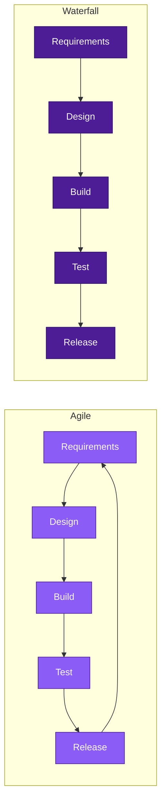

# Agile vs. Waterfall: Same Steps, Different Shape

Both processes use the same five steps for this example: requirements, design, build, test, release. Although your organization's steps may vary.

Agile runs them as a small loop that cycles back to the start; Waterfall runs them once, straight through.

