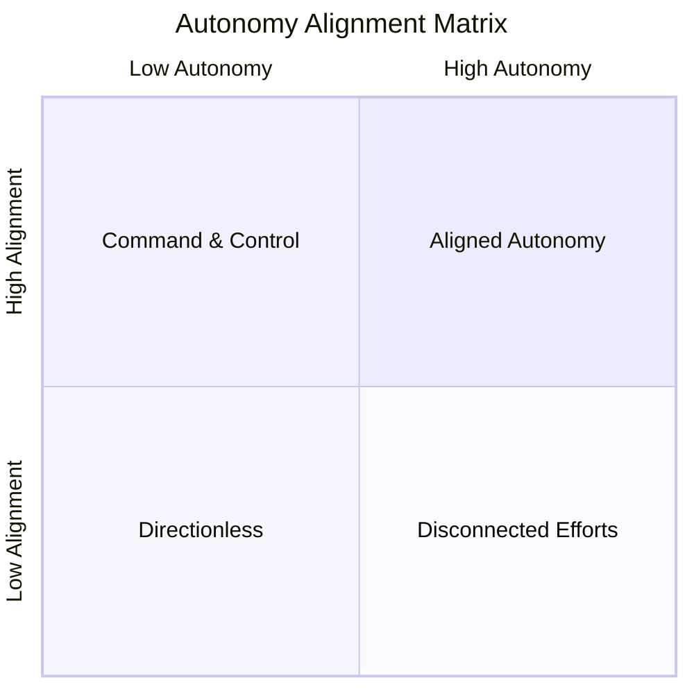

# Autonomy Alignment Matrix

Adapted from Henrik Kniberg's autonomy/alignment sketch. The two axes are alignment (does the team know what and why) and autonomy (does the team get to choose how). The sweet spot is the top-right: aligned autonomy, teams free to decide how to work while staying clear on what the organization is trying to achieve.

