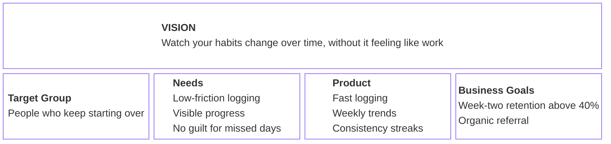
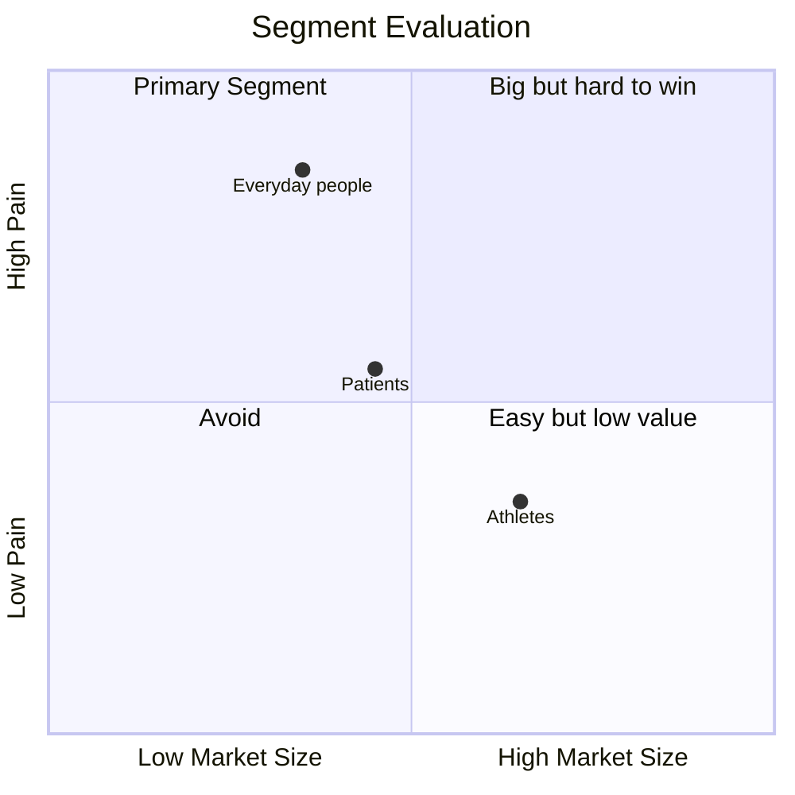
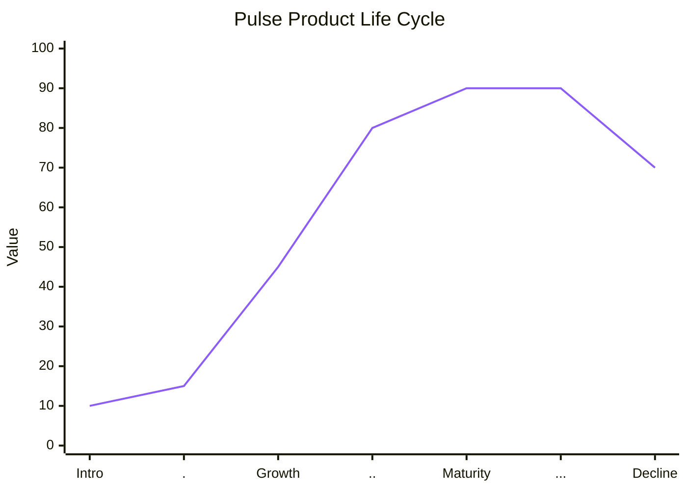

# Chapter 2 Lab — Strategy (completed example)

> This is a completed example for reference. Do not copy this for your submission — your lab should reflect your own decision and reasoning.

---

## Part 1 — Product Vision Board

> Notice what's not in the product box: social features, nutrition analysis, wearable integrations. Those don't yet connect to the stated needs of the target group, so they stay out for now.

---

## Part 2 — Segmentation diagram and primary segment

**Primary segment:** Everyday people who have tried at least one other health app and stopped using it within a month.

**Why this segment first, and what makes them winnable?** This group has the smallest market of the three but the most acute pain. Athletes are well served by existing performance trackers, and patients need clinical-grade rigor that doesn't fit a first version. Everyday people who keep starting over have a recurring, unaddressed problem, and the bar for winning them is simplicity and consistency, both achievable in a first version.

---

## Part 3 — Positioning statement

> For people who want to build better health habits but keep losing momentum, Pulse is a health tracking app that makes daily logging fast and shows you your progress over weeks. Unlike fitness apps built for performance tracking, Pulse is designed for consistency, not optimization.

---

## Part 4 — Lifecycle diagram

**What should Pulse be doing at this stage, and what should it be avoiding?** Pulse is in the introduction stage, with early signs of moving toward growth. The priority is proving the core hypothesis, that low-friction logging plus visible trends improves consistency, with a small group of users in the primary segment. Pulse should avoid scaling acquisition or broad marketing spend before that hypothesis is validated. Growth-stage tactics applied this early would amplify a product that hasn't yet proven what works.

---

## Part 5 — Use AI, then check it

I ran the positioning statement through an AI tool and asked it to challenge the wording.

**One thing the AI suggested that you kept, and why:** It suggested naming a specific competitor category ("fitness apps built for performance tracking") instead of the vaguer "other health apps" I originally wrote. I kept this because it makes the differentiation concrete and testable rather than generic.

**One thing you rejected, and why:** The AI suggested adding a claim that "73% of health app users abandon the app within the first month" to strengthen the positioning's urgency. I rejected this because I could not find a primary source for that statistic. It read as plausible but unverified, exactly the kind of confident, ungrounded number this chapter warns against. The positioning works without it.

---

## Acceptance criteria

- [x] All five Vision Board areas are filled and internally consistent
- [x] The segmentation diagram plots at least three segments and clearly marks the primary segment
- [x] The positioning statement names a specific alternative and a specific differentiator
- [x] The lifecycle diagram marks Pulse's current stage and connects to a stated strategic implication
- [x] The AI section names one suggestion kept and one rejected, with reasoning for each