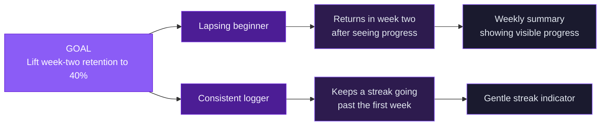

# Chapter 3 Lab — Discovery (completed example)

> This is a completed example for reference. Do not copy this for your submission. Your lab should reflect your own conversation and reasoning. In particular, your interview quotes must come from a real person you actually spoke with.

---

## Part 1 — Impact map

- **Goal:** Lift week-two retention to 40%.
- **Actors:** The lapsing beginner (logs a few days, then goes quiet) and the consistent logger (logs daily but may drift).
- **Impacts:** The lapsing beginner returns in week two because they saw a trend worth chasing; the consistent logger keeps a streak alive past the first week.
- **Deliverables:** A weekly summary showing visible progress, and a gentle streak indicator.

---

## Part 2 — Conduct a real interview

I interviewed a friend's roommate, age 29, who has downloaded and quit three different fitness apps in the past two years. We spoke for about twelve minutes.

**My five planned questions:**

1. Tell me about the last health or habit app you stopped using. What happened?
2. Walk me through the last few days before you stopped opening it.
3. When you were using it, was there ever a moment it felt like it was working? What was that like?
4. What made you download one in the first place?
5. What were you using it alongside, if anything?

**Three things the person actually said:**

1. "I didn't quit on purpose. I just looked up one day and realized I hadn't opened it in like two weeks, and then opening it felt pointless because there was this big gap."
2. "The first few days I actually liked it, it felt good to fill it in. But once I missed a day it was like the spell broke."
3. "Honestly I never knew if any of it was doing anything. It just felt like data entry."

**One thing that surprised me or contradicted my expectation:** I expected the reason to be that logging was too much work. The real trigger was the *gap*, missing a couple of days made coming back feel like failure, so they avoided it entirely. The friction wasn't the logging. It was the guilt of a broken streak.

---

## Part 3 — Competitive scan

**Product 1: MyFitnessPal**
- One thing it does well: enormous food database makes logging a specific meal fast once you're in the habit.
- One recurring complaint from its reviews: users say it feels like a chore and that detailed calorie tracking becomes exhausting to maintain.

**Product 2: Apple Health**
- One thing it does well: passively collects data (steps, sleep) without the user doing anything.
- One recurring complaint from its reviews: users say the data is there but it doesn't tell them what it means or what to do with it.

**What these reveal about the problem Pulse is solving:** Existing apps fail in two opposite ways, either they demand too much effort to keep up (MyFitnessPal) or they collect data that never turns into a felt sense of progress (Apple Health), which points to a gap for something low-effort that still makes progress visible.

---

## Part 4 — Hypothesis

> We believe week-two retention will rise if lapsing users get a weekly summary showing visible progress, because it gives them a reason to return that doesn't depend on a perfect daily streak.

**The riskiest assumption inside it:** That users will notice and value the trend. If seeing their progress doesn't actually motivate a return, the summary changes nothing, no matter how well it's built. (The interview hinted at a second risk: that a missed-day "gap" creates avoidance, so the summary has to feel encouraging on a down week, not accusatory.)

---

## Part 5 — Experiment

- **Validation method:** An AI-built throwaway prototype of the weekly summary, shown to five lapsing users in short interviews.
- **Why it fits the risk:** The riskiest assumption is about whether users notice and value the trend, a problem-and-experience question. A working prototype lets me watch their real reaction cheaply, without building the production feature. A conversation alone wouldn't show me how they react to actually seeing the summary.
- **A result that says the assumption holds:** Users react with visible interest or relief when shown their progress, especially on a week with missed days, and say it would make them more likely to reopen the app.
- **A result that says stop:** Users shrug at the summary or fixate on the missed days as failure. That would mean visible progress isn't the motivator, or that the summary makes the gap problem worse.

---

## Part 6 — Use AI, then check it

I asked an AI tool to challenge my hypothesis by naming a riskier assumption than the one I chose.

- **One thing I kept:** It pointed out that I'm assuming lapsing users open the app at all to see the summary, when the interview suggested they avoid it after a gap. That's a genuinely riskier assumption, so I added a delivery question (could the summary reach them outside the app, like a notification or email?) to my next round.
- **One thing I rejected:** It suggested I survey 500 users to "statistically validate" the summary's appeal before prototyping. I rejected that as over-building for this stage; five conversations with a prototype will teach me more, faster, about whether the trend lands than a large survey of stated preferences.

> I asked the AI for a statistic on health-app abandonment rates and it gave me a confident figure with no source. I left it out.

---

## Acceptance criteria

- [x] The impact map starts from a measurable goal, not a feature
- [x] A real interview was conducted, with five planned questions and three captured quotes
- [x] The competitive scan covers two real products with a specific insight about the problem
- [x] At least one hypothesis is written in the "we believe… if…" form, informed by the interview
- [x] The riskiest assumption is named, with a matching experiment to test it
- [x] The AI section names one suggestion kept and one rejected, with reasoning