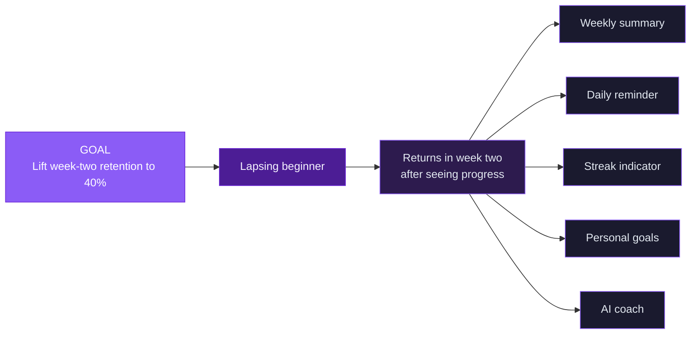
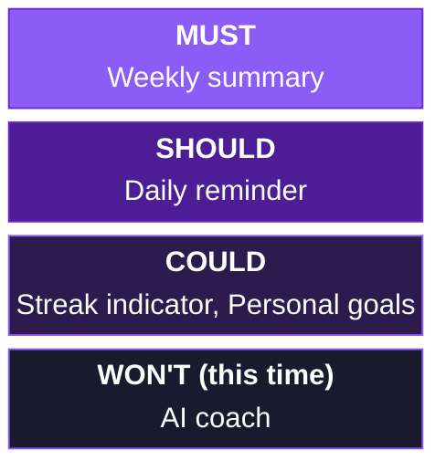

# Chapter 4 Lab — Prioritization (completed example)

> This is a completed example for reference. Do not copy this for your submission. Your lab should reflect your own impact map, estimates, and reasoning.

---

## Part 1 — Start with an impact map

- **Goal:** Lift week-two retention to 40%.
- **Actor:** The lapsing beginner, someone who logs for a few days and then goes quiet.
- **Impact:** They return in week two because they saw a trend worth chasing.

**Deliverables (my backlog):**

1. **Weekly summary** — a read-only screen showing the past seven days of progress and one trend.
2. **Daily reminder** — a gentle notification prompting the user to log.
3. **Streak indicator** — a visible count of consecutive logged days.
4. **Personal goals** — let users set a target on sign-up (for example, "log 5 days a week").
5. **AI coach** — a conversational feature offering personalized encouragement and guidance.

---

## Part 2 — RICE indicators

Scores use a 1–10 scale for Impact, a percentage for Confidence, and relative person-weeks for Effort. RICE = Reach × Impact × Confidence ÷ Effort.

| Item | Reach | Impact | Confidence | Effort | RICE |
|------|-------|--------|------------|--------|------|
| Weekly summary | 1000 | 8 | 90% | 2 | 3600 |
| Daily reminder | 1000 | 5 | 80% | 1 | 4000 |
| Streak indicator | 1000 | 5 | 70% | 1 | 3500 |
| Personal goals | 600 | 5 | 60% | 3 | 600 |
| AI coach | 1000 | 9 | 30% | 8 | 338 |

**Justifications:**

- **Weekly summary** — Reach: every active user sees it. Impact: high, it's the feature meant to drive return visits. Confidence: high, discovery validated that visible progress matters. Effort: low, it aggregates data already logged.
- **Daily reminder** — Impact: moderate, helps but doesn't create the "aha." Confidence: good, reminders are well-understood. Effort: very low.
- **Streak indicator** — Confidence: lower, the Chapter 3 interview suggested streaks can backfire by making a missed day feel like failure.
- **Personal goals** — Reach: lower, not everyone sets one. Effort: higher, needs onboarding changes.
- **AI coach** — Impact: potentially highest. Confidence: very low, we don't know if users want it. Effort: very high. Low confidence and high effort sink the indicator.

---

## Part 3 — Defend your top choice

I'd build the weekly summary first, even though the daily reminder has a slightly higher RICE indicator. The reminder scores higher only because it's cheaper to build, not because it's more valuable. The summary is the feature that tests our core hypothesis, that visible progress brings lapsing users back, and a reminder without it just nudges people toward a screen that doesn't yet show them why returning is worth it. RICE flagged the two as close, which is exactly the signal to bring judgment in: build the summary first, and the reminder gets more valuable once it has something to point to.

---

## Part 4 — MoSCoW scope

- **Must:** Weekly summary. The release is built around it; without it there's no test of the retention hypothesis.
- **Should:** Daily reminder. Valuable and cheap, but the release still ships without it.
- **Could:** Streak indicator and personal goals, if there's time. The streak indicator also needs care given the missed-day risk from discovery.
- **Won't (this time):** AI coach. Explicitly deferred until we've validated it cheaply, which is the discovery and prototyping work from Chapters 3 and 5. Parked, not killed.

---

## Part 5 — Use AI, then check it

I asked an AI tool to produce RICE indicators for the weekly summary from scratch.

- **One place its estimate differed:** It set Reach at "10,000 users" with apparent confidence. Pulse doesn't have 10,000 active users; the AI invented a plausible-sounding number it had no way to know.
- **Which I trust more, and why:** Mine. I based Reach on Pulse's actual active-user count. The AI's figure was confident, specific, and completely ungrounded.

> This is false precision in action: a number that looks solid but rests on a guess. It's exactly why every RICE input needs a justification I can defend, not a figure I accepted because it was presented confidently.

---

## Acceptance criteria

- [x] An impact map generates the backlog, starting from a measurable goal
- [x] Every RICE input has a one-sentence justification
- [x] The backlog is tagged Must, Should, Could, or Won't
- [x] The Must list is short and at least one item is in Won't with a reason
- [x] Your top choice is defended with RICE indicators and judgment
- [x] The AI section names one differing estimate and which you trust more, with reasoning