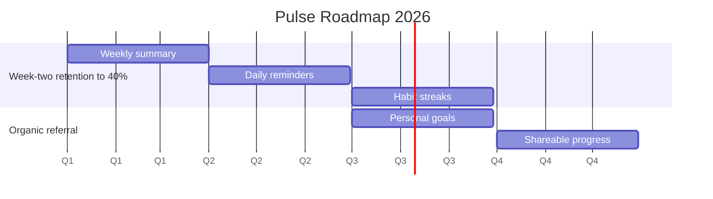

# Chapter 6 Lab — Execution (completed example)

> This is a completed example for reference. Do not copy this for your submission. Your lab should reflect your own choices and reasoning.

---

## Part 1 — Pick a method

I'd run the _Pulse_ team on Scrum, with a one-week sprint. The work is a steady stream of small, related improvements (the summary, then reminders, then the features after) where a regular rhythm helps: a short planning session to pick the week's work, a review to show what shipped, and a retrospective to improve how the team operates. The requirements still shift as we learn from users, which rules out Waterfall. What would change my mind: if _Pulse_ later took on an unpredictable support or bug-fix workload, I'd run that stream as Kanban alongside the Scrum work, because flow and limiting work-in-progress fit unplanned arrivals better than a fixed sprint.

---

## Part 2 — Roadmap

The objectives align to the business goals we set in the Chapter 2 vision board (week-two retention above 40%, and organic referral from users who feel genuine progress) and the retention goal we worked in Chapter 3. The roadmap shows what we plan to ship to hit those goals, roughly when (by quarter), and why, each feature sits under the objective it serves.

Reasoning: The weekly summary comes first because it carries our core retention bet from Chapter 3; reminders and streaks follow under the same retention objective. The referral objective comes later, once retention is actually moving, there's no point driving referral to a product people don't yet stick with. Shareable progress sits in Q4 and is deliberately the least defined, because it's the furthest out.

**Caveat.** This is a plan created on estimates. They may shift as we uncover complexity, lose time, or see business priorities change. If a date moves, I'll re-estimate and communicate the change and the why and downstream impacts and/or options to accelerate (e.g. use vendors).

---

## Part 3 — DACI for one decision

**Decision:** which platform should _Pulse_ build for first, web or native mobile?

- **Driver:** Product Manager, who frames the options (reach, cost, speed to build) and runs the decision.
- **Approver:** the product sponsor, the single person who makes the final call.
- **Contributors:** engineering (effort and feasibility on each platform), design (the experience trade-offs), and support (what users are already asking for).
- **Informed:** company leadership, told the outcome.
- **Principles (hard constraints):** user data must be handled to the same privacy standard on whichever platform we choose; accessibility (AODA) compliance is required regardless of platform.

---

## Part 4 — Use AI, then check it

I handed my DACI to an AI tool and asked it to challenge the roles.

- **One thing I kept:** It pointed out that support is listed as a Contributor but is often the first to hear platform complaints, and asked whether support should weigh more heavily. I kept support as a Contributor (not Approver), but its challenge made me add "what users are already asking for" explicitly as support's contribution, which improved the input.
- **One thing I rejected:** It suggested making engineering a co-Approver alongside the sponsor, since feasibility is so central. I rejected that, two Approvers is exactly the drift DACI exists to prevent. Engineering's feasibility view is vital, but it informs the call, co-ownership isn't the right call.

---

## Acceptance criteria

- [x] The method choice is justified by something specific about the work
- [x] The roadmap shows the what, approximate when, and the why (each feature tied to an objective)
- [x] The DACI has exactly one Approver
- [x] Hard constraints sit in Principles, not as a vote
- [x] The AI section names one suggestion kept and one rejected, with reasoning