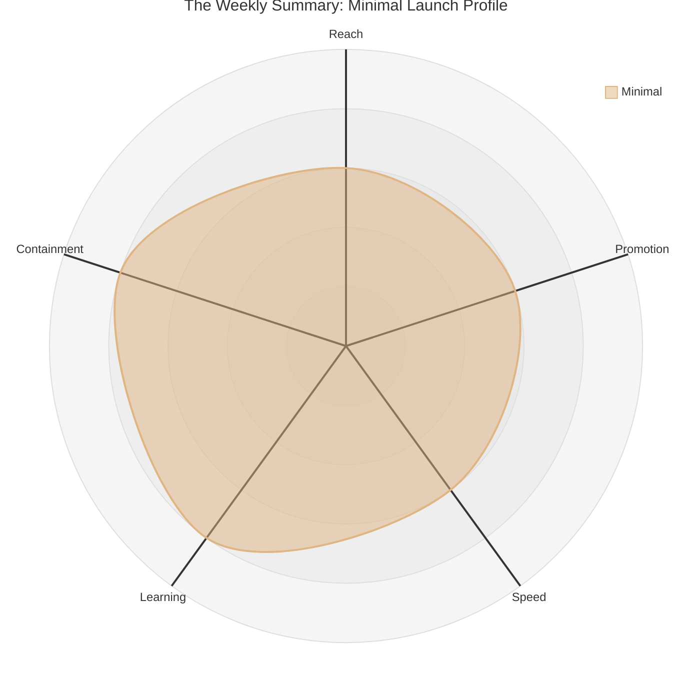

# Chapter 7 Lab — Go-to-Market (completed example)

> This is a completed example for reference. Do not copy this for your submission. Your lab should reflect your own feature and reasoning.

---

## Part 1 — Plot the strategies and choose one

Feature: the _Pulse_ weekly summary, with its one AI-written message.

I compared all three strategies on the radar first (the comparison chart is in the chapter), then chose minimal. The chart below shows the profile of the strategy I landed on: moderate on reach, promotion, and speed, leaning toward learning and containment.

**Chosen strategy:** Minimal.

**Justification.** The summary is our biggest committed bet, and it has one AI-written part that could say the wrong thing, so I want to learn before everyone sees it. The minimal shape leans toward Learning and Containment, exactly what I need: a small audience first, room to watch the message behave, and an easy pull-back if it doesn't. I'm trading away the reach and speed of a full launch, but for a feature carrying real risk that's the right trade, I'd rather find a problem on a small group than on the whole user base.

---

## Part 2 — If minimal, define the five elements

- **Audience:** a random 10% of active users, controlled with a feature flag.
- **Promotion level:** no announcement to this cohort beyond the summary simply appearing; quiet enough to test the behaviour without setting expectations.
- **Success metric:** lapsing users who see the summary come back the following week, without the AI message saying anything it shouldn't.
- **Expansion criteria:** widen to 30% after two weeks if the return rate holds above target and the message trips no guardrails in production.
- **Rollback trigger:** if the AI message violates a guardrail in production (shaming a user, inventing a number), pull the AI message and fall back to a plain templated line while it's fixed. The summary keeps working; only the risky part comes out.

---

## Part 3 — Cross-functional launch plan

| Area | Define ready |
|---|---|
| Communications | In-app communication introduces the summary to the cohort |
| Support | Ready to field confusion or complaints; has been trained on the feature and has talking-points for user tickets that come in |
| Engineering | Fully tested feature, will release and monitor AI call use |
| Go/no-go call | Product manager has call and is watching return-rate metric |

---

## Part 4 — Keep the claims honest

**Launch copy:** "Your new weekly summary shows how your habits are trending, so you can see your progress at a glance."

**Check.** "Shows how your habits are trending" is true and sourced, it's exactly what the feature does. I deliberately avoided "improves your health" or "helps you build better habits," because those are outcome claims I can't yet prove and, for a health product, an unproven benefit claim can cross a regulatory line. "See your progress at a glance" describes the feature, not a health outcome, so it's safe to stand behind.

---

## Part 5 — Use AI, then check it

I asked an AI tool to draft launch copy for the summary.

- **One claim the AI made that I'd need to verify or soften:** It wrote that the summary "keeps you motivated and on track to reach your goals."
- **Why:** That's an outcome claim, it asserts the feature causes motivation and goal achievement, which I haven't proven and which edges toward a health benefit claim. I softened it to describe what the feature shows, not what it promises the user will achieve.

---

## Acceptance criteria

- [x] The three strategies are plotted on a radar, and the chosen strategy is justified against the feature's risk and novelty using it
- [x] If a minimal launch, audience, promotion level, success metric, expansion criteria, and rollback trigger are all defined with real thresholds
- [x] Cross-functional owners are named, with a readiness definition for each
- [x] Every public claim in the launch copy is checked and sourced, with any regulatory risk flagged
- [x] The AI section names one claim that needed verifying or softening, with reasoning