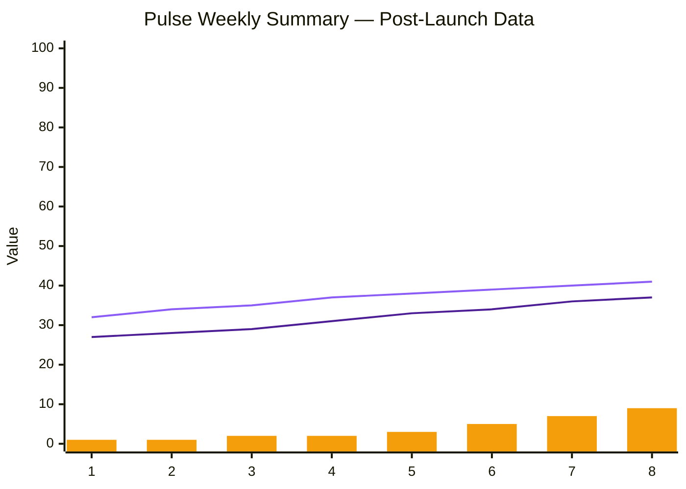
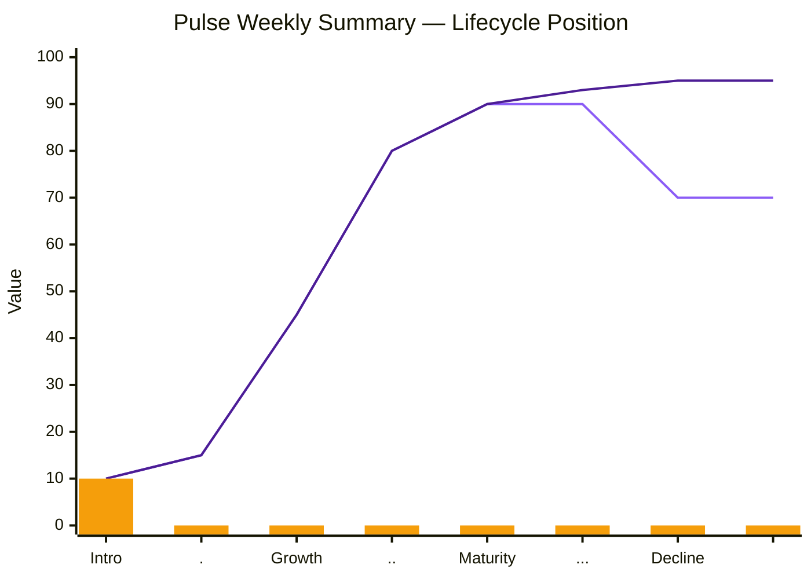
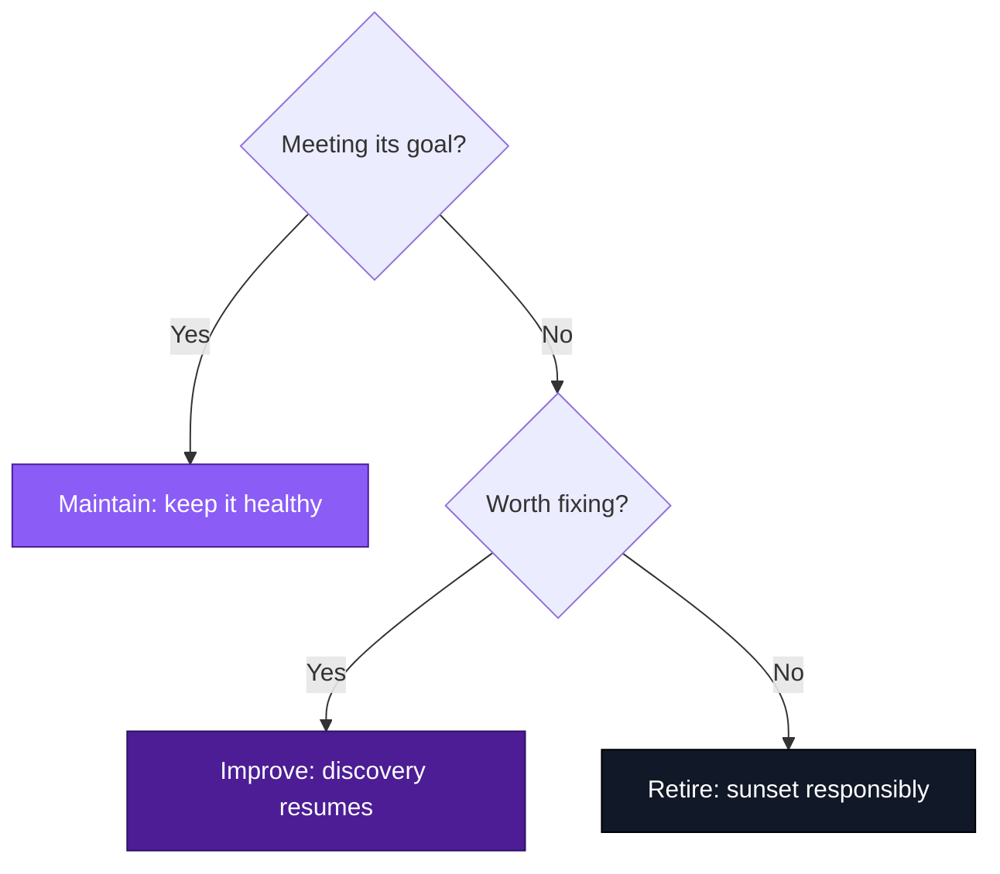

# Chapter 8 Lab — Post-Launch Management (completed example)

> This is a completed example for reference. Do not copy this for your submission. Your lab should reflect your own reading of the data and your own call.

---

## Part 1 — Read the data

Both indicators climb steadily across all eight weeks, no plateau yet. The leading indicator (return-after-summary rate) moves from 32% to 41%; the lagging indicator (week-two retention) trails it by a few points each week, moving from 27% to 37%, exactly the relationship you'd expect: the leading metric moves first, and the lagging one confirms it a week or two later.

But the guardrail-flag bars tell a different story. Weeks 1–5 sit flat and low (1, 1, 2, 2, 3). Weeks 6–8 jump to 5, 7, and 9, a clear inflection, not just noise. Support tickets rise on the same schedule (4, 5, 6 in weeks 6–8), and a few of them specifically mention the message's tone feeling "off" on bad weeks. The core engagement numbers look healthy and improving; something underneath them is degrading at the same time.

---

## Part 2 — Locate the lifecycle stage

I placed the marker in Introduction. The rising numbers are good, but they're rising inside a limited cohort: this feature is still soft-launched to roughly 10% of active users, the launch plan from Chapter 7, and hasn't reached the expansion criteria that would widen it further. That's the definition of Introduction, not Growth: the team is still proving the hypothesis works before scaling it, not yet capturing broad momentum. The healthy leading and lagging trends are exactly what should happen if the hypothesis is holding, they're the signal that this feature is ready to earn its way into Growth, but it isn't there yet. The rising guardrail flags matter more at this stage, not less: better to catch and fix drift now, on a small cohort, than after widening.

---

## Part 3 — Make the call

**Verdict: improve, not maintain.**

Against the original success metric, lapsing users returning after seeing the summary, without the AI message tripping a guardrail, the feature is mostly succeeding. The core bet is working: both the leading and lagging numbers are climbing, and there's no sign that's about to stop.

But "without the AI message tripping a guardrail" is the half of the metric that's failing. The guardrail-flag tripled in absolute count over three weeks, and it lines up with support tickets describing exactly the failure mode Chapter 5's guardrails were meant to prevent, a message landing wrong on a bad week. That's not a reason to retire the feature; the underlying hypothesis is proven and the numbers are good. It's a reason to resume discovery specifically on the AI message: what's changed in the inputs it's seeing, why is the tone slipping on down weeks, and does the prompt need tightening or the eval set need new adversarial cases that weren't caught at launch.

---

## Part 4 — State the kill/pivot line and monitoring plan

**Kill/pivot line:** If guardrail violations exceed 10 in a single week, or the week-over-week guardrail count rises for a third consecutive week without intervention, pull the AI-generated message and fall back to the plain templated line (the graceful fallback established at launch in Chapter 7) while the message is fixed. 

**Monitoring plan:**
- **Return-after-summary rate** (leading) — confirms the core bet keeps working.
- **Week-two retention** (lagging) — confirms it's holding at the outcome level.
- **Guardrail flags, weekly count and rate of change** (behavioural signal) — the one that's currently drifting and needs the closest watching.
- **Support ticket themes** — qualitative check that the guardrail-flag trend is showing up as something users actually notice, not just an internal eval number.

---

## Part 5 — Use AI, then check it

I handed the dataset to an AI tool and asked for a maintain/improve/retire recommendation.

- **One thing it saw that I missed:** it flagged that the *rate* of guardrail flags relative to messages sent (guardrail flags ÷ AI messages sent) was accelerating faster than the raw count alone suggested, from about 0.25% of messages in week 1 to about 1.6% in week 8, which is a  six-fold increase in the violation rate, not just a rise in absolute count as usage grew. That's a clear way to see the drift than the raw numbers I'd been looking at.
- **One thing it got wrong or overstated:** it recommended retiring the AI-generated message entirely, calling the guardrail trend "a serious safety failure." That overstates it. Nine flags out of 575 messages in the worst week is still under 2% of all messages sent, and every other metric is healthy and improving. This is a real, worsening problem worth fixing before it gets bigger, but calling it a safety failure serious enough to retire the feature is a confident claim the data doesn't actually support at this scale. Improve is the right call, not retire.

---

## Acceptance criteria

- [x] The data is read with specific reference to columns and weeks, and a leading vs. lagging indicator is named
- [x] The feature is placed in a lifecycle stage, justified by the data
- [x] The verdict (maintain/improve/retire) is tied to the original success metric
- [x] A kill/pivot line is stated in advance, and a monitoring plan is named
- [x] The AI section names one thing the AI caught and one it got wrong, with reasoning