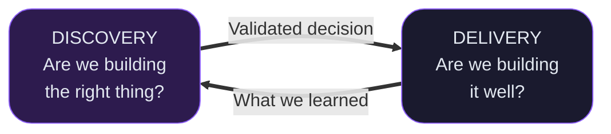
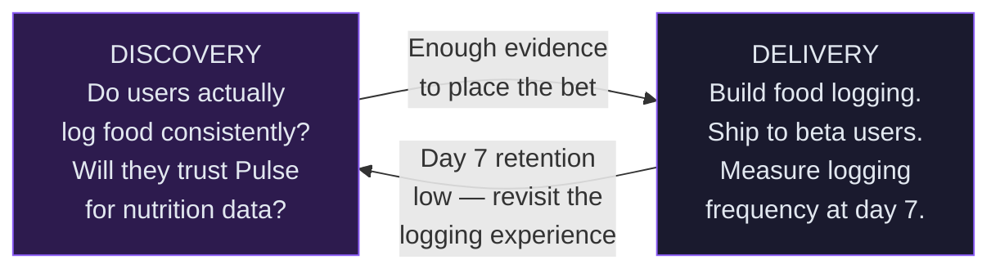

### Framework 2 — Discovery ↔ Delivery

*Figure Discovery ↔ Delivery loop, adapted from Marty Cagan, SVPG.*

---

### Connecting the framework to Pulse

Pulse is considering adding a food logging feature. The team has heard users ask for it, but that's not enough to build on.

Discovery doesn't stop when delivery starts. The Pulse team ships to beta users and day 7 retention is low — users try it once and don't come back. That result feeds straight back into discovery: is the logging too slow? Too many fields? Wrong mental model of what a food log should feel like? Delivery produced the question. Discovery finds the answer.