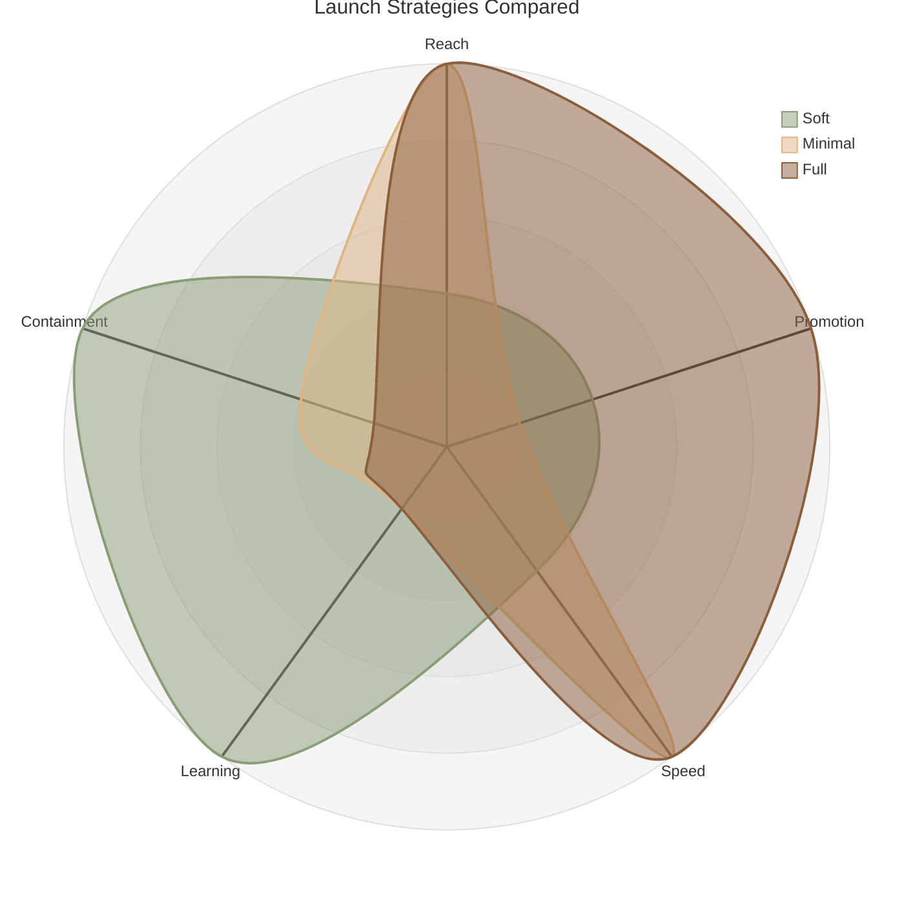

# Launch Strategies Compared

The three launch strategies: soft, minimal, and full, visualized on a radar diagram.

## How to read it

Each spoke is one characteristic of a launch, scored from the centre (low) to the outer edge (high). Each coloured shape is one launch strategy. The further a shape stretches along a spoke, the higher that strategy scores on it. What matters is the overall shape each strategy makes, and how the shapes differ.

- **Reach:** how many users see it on day one.
- **Promotion:** how loudly it's announced.
- **Speed:** how quickly everyone gets it.
- **Learning:** how much you get to learn before the whole audience is exposed.
- **Containment:** how small the blast radius stays if something goes wrong.

**Soft launch** stretches toward learning and containment, and stays low on reach, speed, and promotion. That's the cautious, de-risking shape toward the left. Only a few people at first, lots of room to learn, easy to pull back.

**Full launch** is the near-mirror image stretching to the right. It's high on reach, promotion, and speed, low on learning and containment. Everyone gets it, loudly and fast, with little protection if it's wrong.

**Minimal launch** is wide and fast like a full launch, but quiet, and just as low on learning and containment. Everyone gets it with no fanfare.

*Note: the scores here are illustrative, your team should score on each point. Remember the diagram doesn't decide your launch strategy, you do. This is designed to give you visual direction when considering a launch approach.*