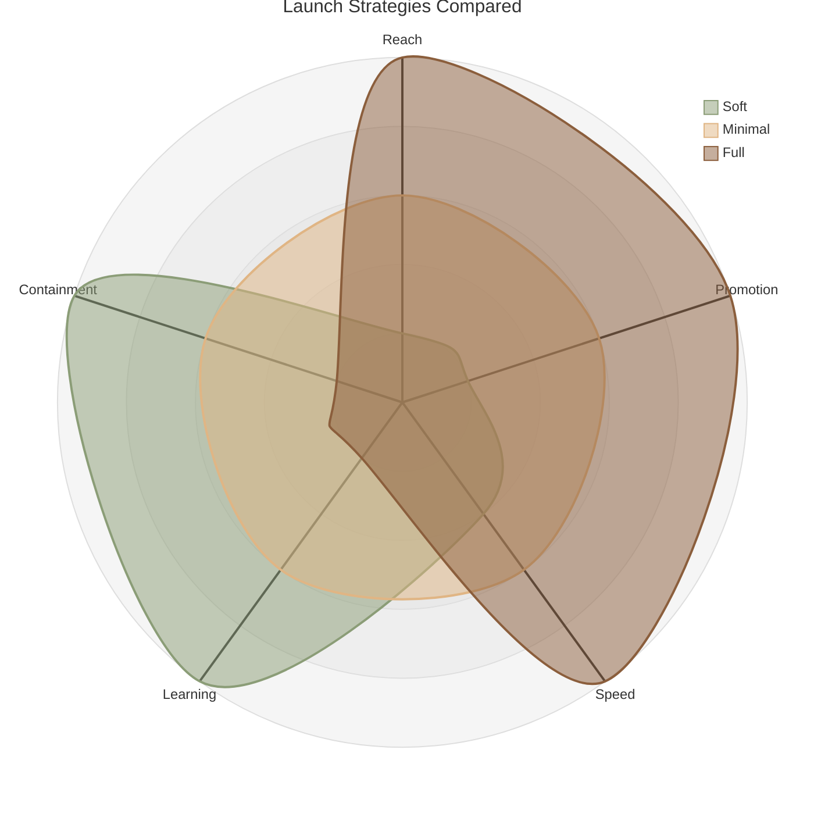

# Launch Strategies Compared

The three launch strategies: soft, minimal, and full, visualized on a radar diagram.

## How to read it

Each spoke is one characteristic of a launch, scored from the centre (low) to the outer edge (high). Each coloured shape is one launch strategy. The further a shape stretches along a spoke, the higher that strategy scores on it. What matters is the overall shape each strategy makes, and how the shapes differ.

- **Reach:** how many users see it on day one.
- **Promotion:** how loudly it's announced.
- **Speed:** how quickly everyone gets it.
- **Learning:** how much you get to learn before the whole audience is exposed.
- **Containment:** how small the blast radius stays if something goes wrong.

**Soft launch**. The product or feature just appears, with little or no announcement. No campaign, only a small coordinated push.

**Full launch**. The opposite end: a coordinated, high-visibility release across multiple teams, marketing, support, sales, sometimes PR, timed for maximum reach and attention.

**Minimal launch**. In between soft and full. It can mean a staged release to a limited audience that widens over time, or a full release with reduced promotion. Either way, less exposure than a full launch, more than a soft one. 

*Note: the scores here are illustrative, your team should score on each point. Remember the diagram doesn't decide your launch strategy, you do. This is designed to give you visual direction when considering a launch approach.*