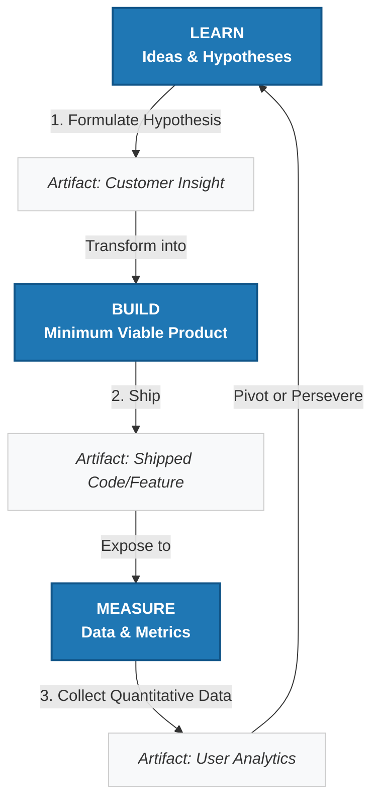

### Visualizing the Feedback Loop

To avoid building a product nobody wants, we must utilize a tight, iterative cycle. Below is the structured feedback loop designed to help teams move from initial assumptions to validated learning as efficiently as possible.

**Figure X.X:** *The Build-Measure-Learn Feedback Loop. Framework adapted from Eric Ries’s methodology in "The Lean Startup" (Crown Business, 2011). Graphic structured for markdown rendering.*

---

### Connecting the Framework to the Pulse Case Study

The power of this loop lies in its velocity. The faster you travel through it, the faster your product finds market fit. Map the Pulse app against this framework.

*   **Trapped in the Build Phase:** Amazon spent nearly four years working in complete secrecy. Instead of building a small slice of value, measuring reactions, and learning, they kept building custom hardware, advanced math algorithms, and complex 3D perspective arrays in a vacuum.
*   **The Cost of Delayed Measurement:** Because they did not ship a Minimum Viable Product (MVP), they collected zero customer data for forty-eight months. 
*   **The Catastrophic Learning Stage:** By the time Amazon finally entered the "Learn" phase on launch day, they learned everything all at once at the cost of a $170 million write-down. 

***

Pulse
