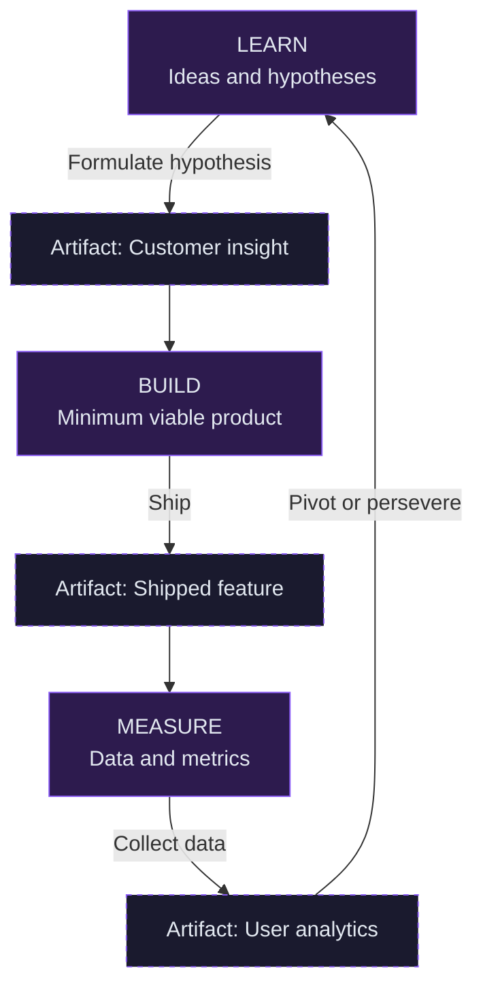
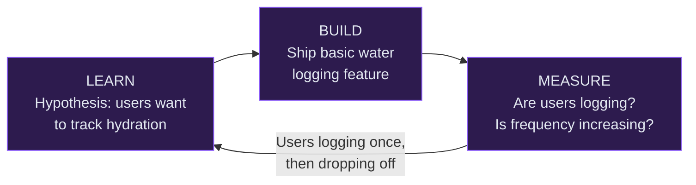

### Visualizing the feedback loop

To avoid building a product nobody wants, we need a tight, iterative cycle. Below is the feedback loop that moves a team from initial assumptions to validated learning.

*Figure: The Learn → Build → Measure feedback loop, adapted from Eric Ries, The Lean Startup (Crown Business, 2011).*

---

### Connecting the framework to Pulse

The power of this loop is velocity. The faster a team moves through it, the faster the product finds what actually works.

Consider an early Pulse scenario: the team believes users want to log water intake to build a hydration habit. That's the hypothesis.

The team ships the minimum version, measures logging frequency, and learns that users log once and stop. Most teams would call that a failed feature. A PM running this loop calls it the next hypothesis.