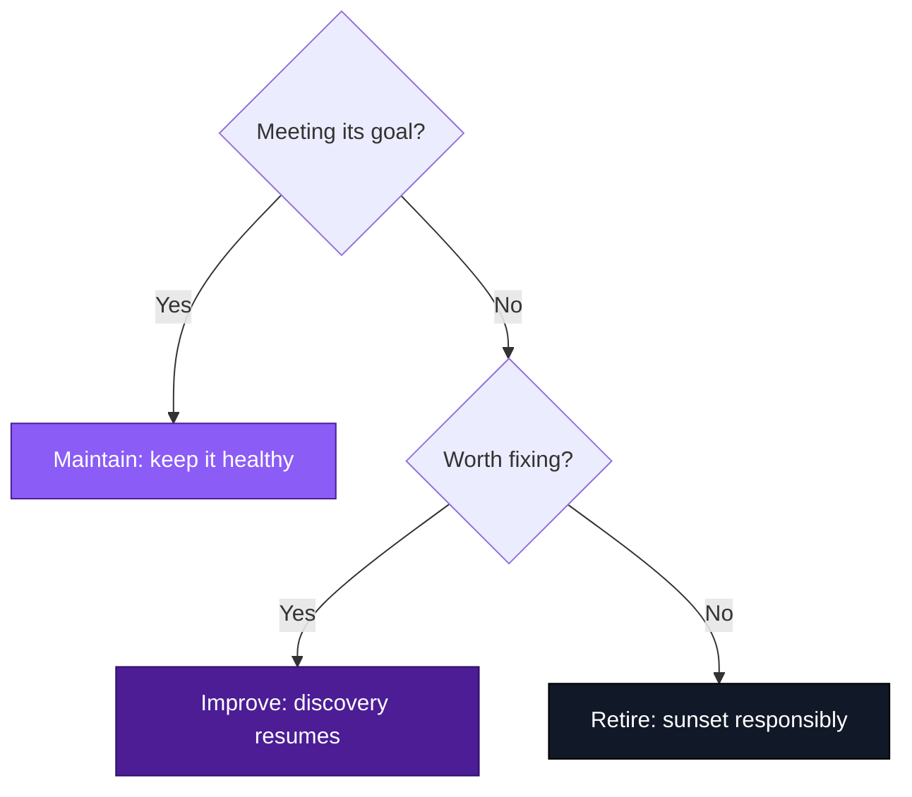

## Maintain, improve or retire decision path

```mermaid
flowchart TD
    A{Meeting its goal?} -->|Yes| M[Maintain: keep it healthy]
    A -->|No| B{Worth fixing?}
    B -->|Yes| I[Improve: discovery resumes]
    B -->|No| R[Retire: sunset responsibly]
    classDef maintain fill:#8B5CF6,stroke:#4C1D95,color:#fff
    classDef improve fill:#4C1D95,stroke:#2e1065,color:#fff
    classDef retire fill:#111827,stroke:#000000,color:#fff
    class M maintain
    class I improve
    class R retire
```