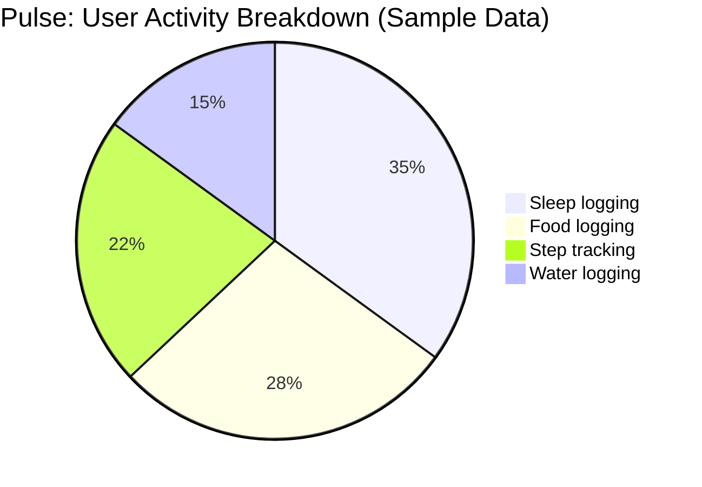
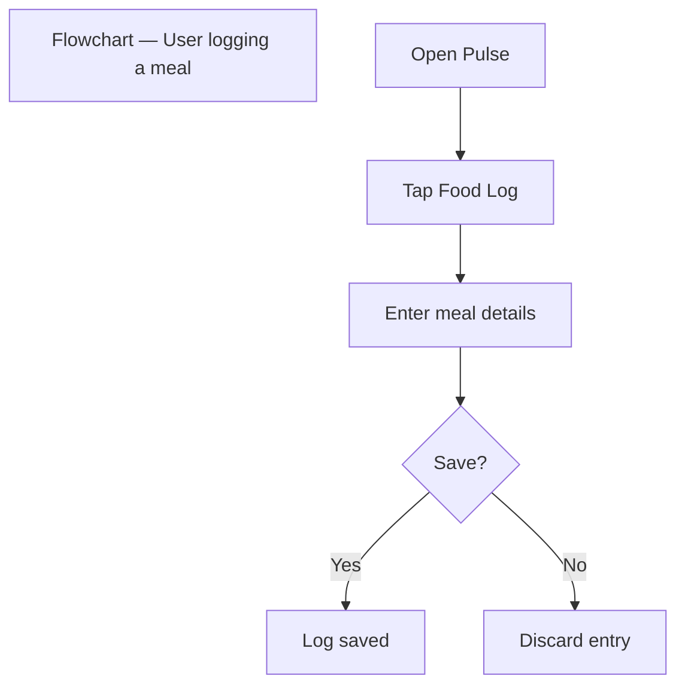
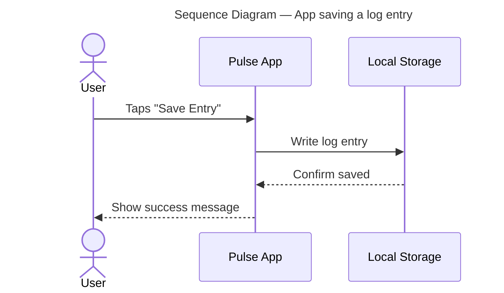
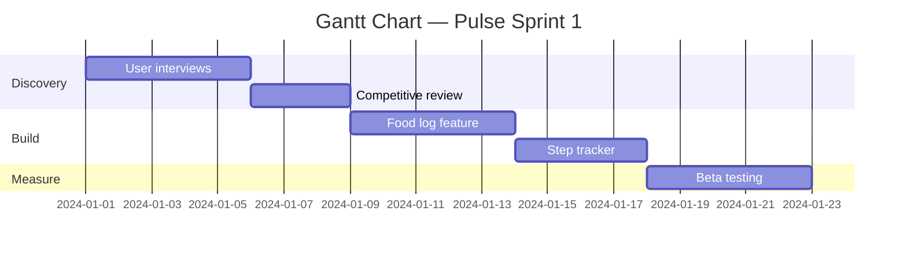
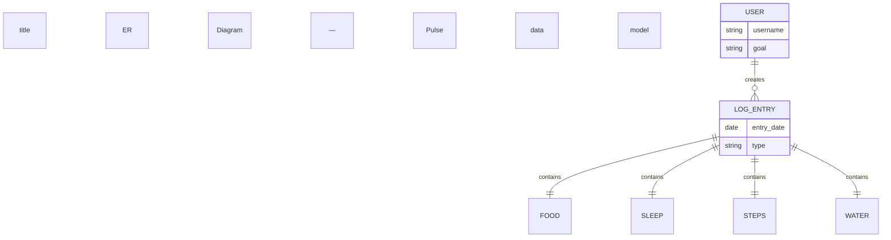
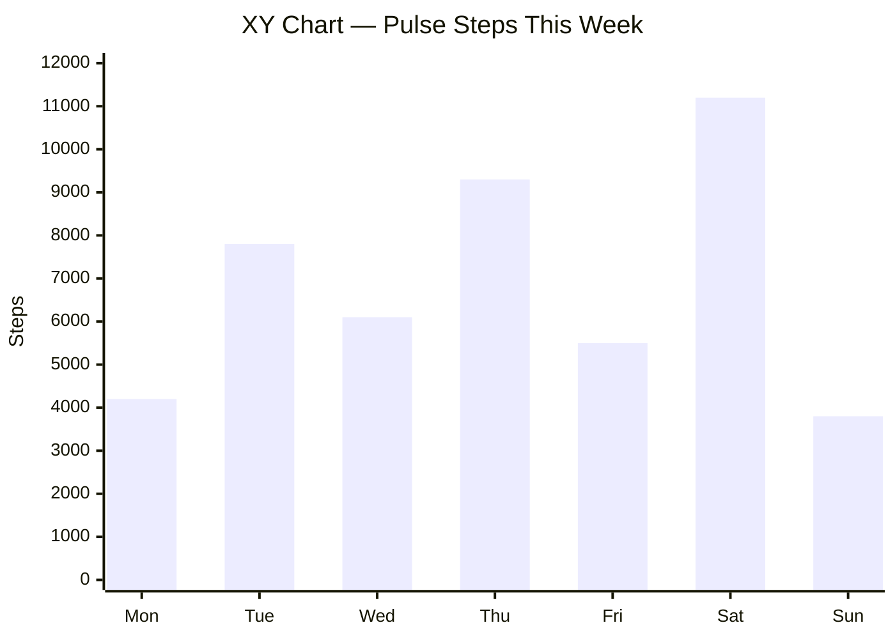
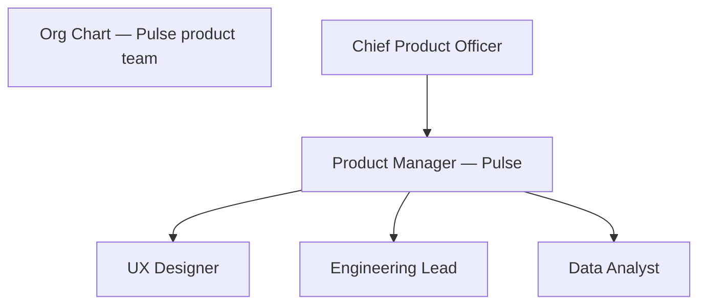

```mermaid
pie title Pulse: User Activity Breakdown (Sample Data)
    "Sleep logging" : 35
    "Food logging" : 28
    "Step tracking" : 22
    "Water logging" : 15
```

```mermaid
flowchart TD
    title["Flowchart — User logging a meal"]
    A["Open Pulse"] --> B["Tap Food Log"]
    B --> C["Enter meal details"]
    C --> D{"Save?"}
    D -->|Yes| E["Log saved"]
    D -->|No| F["Discard entry"]
```

```mermaid
sequenceDiagram
    title Sequence Diagram — App saving a log entry
    actor User
    participant App as Pulse App
    participant Storage as Local Storage
    User->>App: Taps "Save Entry"
    App->>Storage: Write log entry
    Storage-->>App: Confirm saved
    App-->>User: Show success message
```

```mermaid
gantt
    title Gantt Chart — Pulse Sprint 1
    dateFormat YYYY-MM-DD
    section Discovery
        User interviews     :a1, 2024-01-01, 5d
        Competitive review  :a2, after a1, 3d
    section Build
        Food log feature    :b1, 2024-01-09, 5d
        Step tracker        :b2, after b1, 4d
    section Measure
        Beta testing        :c1, after b2, 5d
```

```mermaid
erDiagram
    title ER Diagram — Pulse data model
    USER ||--o{ LOG_ENTRY : creates
    LOG_ENTRY ||--|| FOOD : contains
    LOG_ENTRY ||--|| SLEEP : contains
    LOG_ENTRY ||--|| STEPS : contains
    LOG_ENTRY ||--|| WATER : contains
    USER {
        string username
        string goal
    }
    LOG_ENTRY {
        date entry_date
        string type
    }
```

```mermaid
xychart-beta
    title "XY Chart — Pulse Steps This Week"
    x-axis ["Mon", "Tue", "Wed", "Thu", "Fri", "Sat", "Sun"]
    y-axis "Steps" 0 --> 12000
    bar [4200, 7800, 6100, 9300, 5500, 11200, 3800]
```

```mermaid
flowchart TD
    title["Org Chart — Pulse product team"]
    CPO["Chief Product Officer"]
    PM["Product Manager — Pulse"]
    UX["UX Designer"]
    ENG["Engineering Lead"]
    DATA["Data Analyst"]
    CPO --> PM
    PM --> UX
    PM --> ENG
    PM --> DATA
```