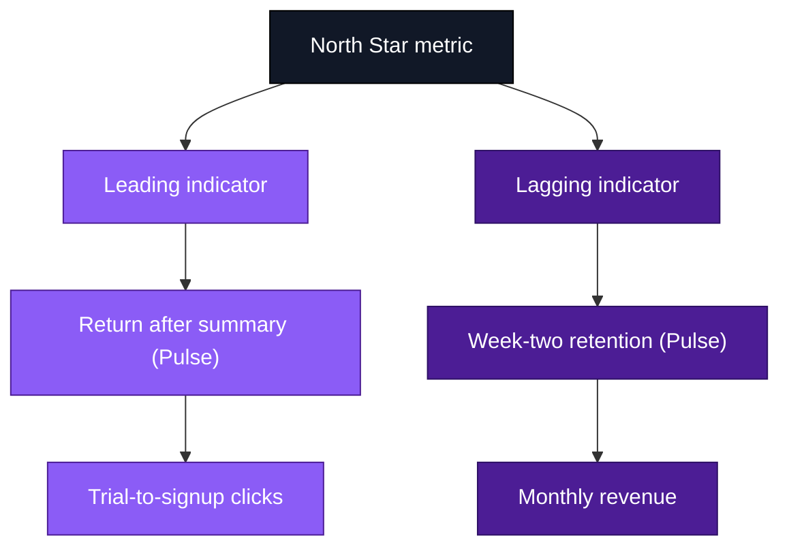

# Metrics Stack

```mermaid
flowchart TD
    NS[North Star metric] --> L[Leading indicator]
    NS --> G[Lagging indicator]
    L --> L1["Return after summary (Pulse)"]
    L1 --> L2[Trial-to-signup clicks]
    G --> G1["Week-two retention (Pulse)"]
    G1 --> G2[Monthly revenue]

    classDef northstar fill:#111827,stroke:#000000,color:#fff
    classDef leading fill:#8B5CF6,stroke:#4C1D95,color:#fff
    classDef lagging fill:#4C1D95,stroke:#2e1065,color:#fff
    class NS northstar
    class L,L1,L2 leading
    class G,G1,G2 lagging
```