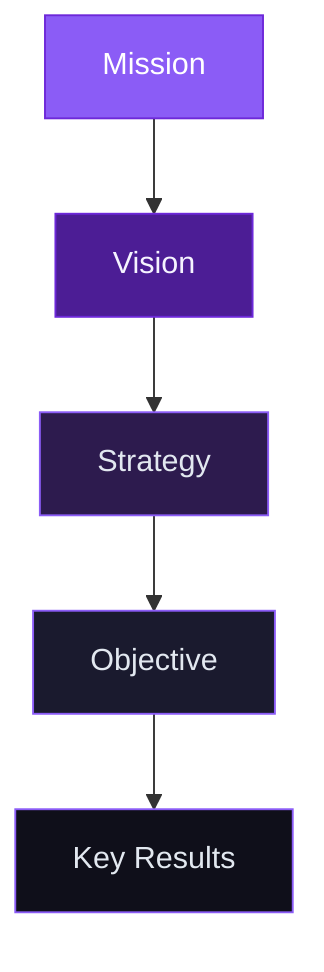

```mermaid
flowchart TD
    M["Mission"]
    V["Vision"]
    S["Strategy"]
    O["Objective"]
    KR["Key Results"]

    M --> V
    V --> S
    S --> O
    O --> KR

    classDef mission   fill:#8B5CF6,stroke:#6D28D9,color:#FFFFFF
    classDef vision    fill:#4C1D95,stroke:#6D28D9,color:#F5F3FF
    classDef strategy  fill:#2D1B4E,stroke:#8B5CF6,color:#E2E8F0
    classDef objective fill:#1A1A2E,stroke:#8B5CF6,color:#E2E8F0
    classDef kr        fill:#0F0F1A,stroke:#8B5CF6,color:#E2E8F0

    class M mission
    class V vision
    class S strategy
    class O objective
    class KR kr
```