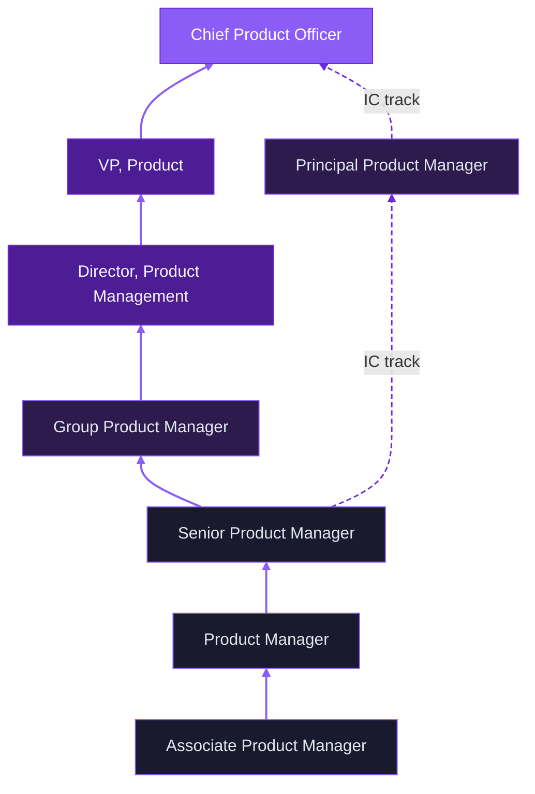

### Career Ladder
The ladder below shows the two paths a PM career can take. Solid lines are the management track — each step adds people responsibility. Dashed lines are the IC track, which diverges at Senior PM for those who want to go deep on craft without moving into management. Both paths can reach the CPO level.

Not every organization has every rung. A startup may have one PM reporting directly to a founder. A large enterprise may have all of these levels plus more in between. Use the ladder to understand the shape of the career, not as a guarantee of what you'll find at any specific company.

