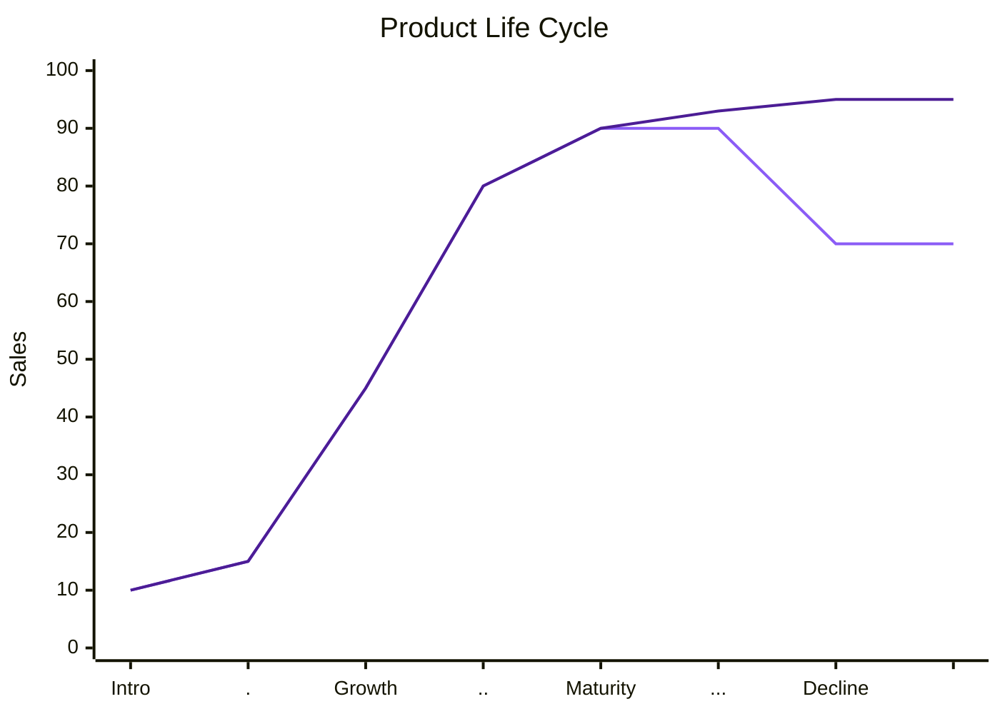

### Framework 3 — Product Lifecycle

A product's value doesn't grow forever on its own. It moves through stages: introduction, growth, maturity, and eventually decline, unless something changes the trajectory before that happens.

The chart below shows two possible paths once a product hits maturity. The lower line is the default: growth plateau and then decline as the market moves on. The upper line shows what happens with a deliberate life cycle extension — a new segment, a new capability, or a new use case introduced at maturity, which resets the curve upward instead of letting it fall.

The Y axis doesn't have to be sales, especially for non-commercial products. It could be users, engagement or some other organization-aligned metric.

The two lines diverge at maturity. That's the fork. The lower line is what happens if nothing changes — the natural decline phase. The upper line is what happens with a life cycle extension decision made at exactly that point, before the decline sets in. Waiting until the lower line has already started dropping makes the extension harder and more expensive to pull off.

*Figure: Product Life Cycle, modified from Product life cycle (Basic) by NT, Wikimedia Commons (commons.wikimedia.org/wiki/File:Product_life_cycle_(Basic)_NT.PNG), used and adapted under Creative Commons licensing.*