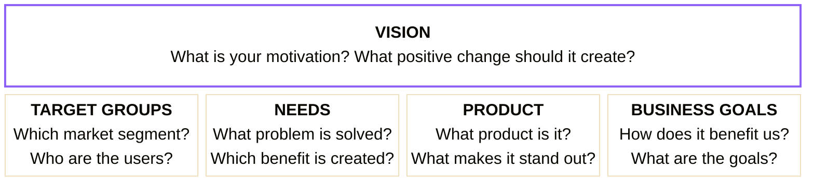
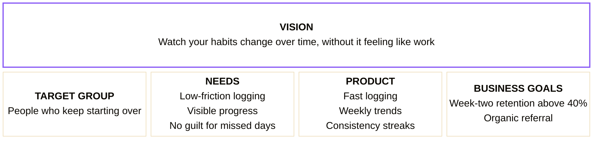

### Framework 1 — Product Vision Board

The vision board forces a single discipline: everything on the board has to justify itself against the vision at the top. Fill the vision first. If a feature in the product box doesn't connect to a stated need, it doesn't belong.

*Figure: Product Vision Board, adapted from Roman Pichler.*

---

### Connecting the framework to Pulse

Pulse's vision is a world where anyone can watch their health habits change over time, without it feeling like work. Run the board against that vision and it immediately rules things out — features that only show today's data don't serve "change over time," and anything that adds friction doesn't serve "without it feeling like work."

Notice what's not in the product box: social features, nutrition analysis, wearable integrations. Those aren't bad ideas — they're ideas that don't yet connect to the stated needs of the target group. If the vision or the target group changes, some of them may belong. For now, the board keeps them out.