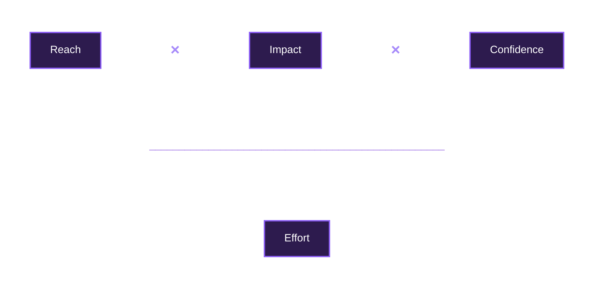

# RICE Priortiziation

The RICE score combines four inputs into a single number. The first three multiply together in the numerator, so each one raises the score. Effort sits underneath as the denominator, which means the more work something takes, the lower it scores. That structure is the whole idea: high reach, impact, and confidence push an item up, while high effort pulls it down.

RICE stands for:

R = Reach

I = Impact

C = Confidence

E = Effort

**RICE FORMULA**: R × I × C ÷ E

**RICE FORMULA VISUALIZED**

*Figure: The RICE scoring formula, adapted from Intercom's RICE framework (2016).*