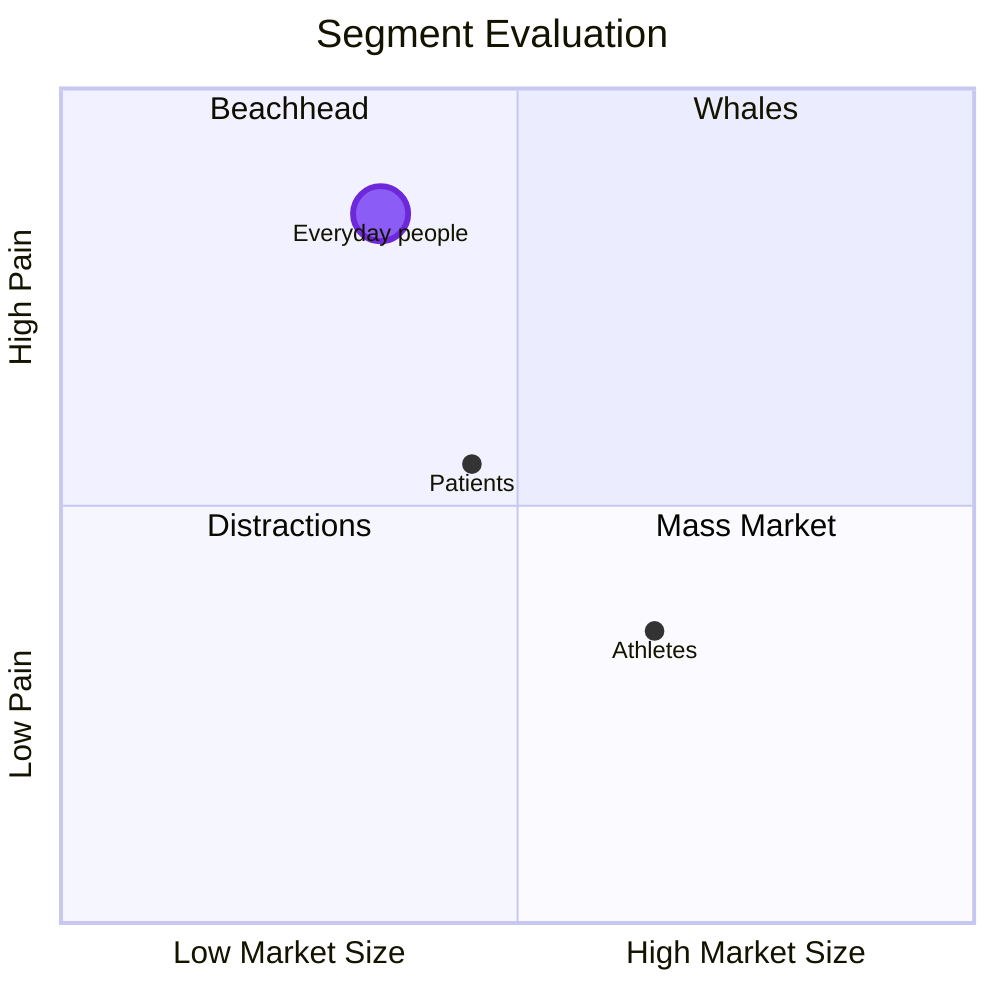

### Framework 2 — Segmentation and positioning

You can't serve everyone first. The quadrant below plots three possible Pulse segments against two dimensions: market size and how acute the pain point is. The temptation is always to chase the biggest quadrant. The better strategy is to find the smallest market with the sharpest pain, prove the product there, and expand once you've won. **Your initial market doesn't have to be your forever market.**

---

### Connecting the framework to Pulse

Pulse could serve athletes tracking performance, patients managing chronic conditions, or everyday people trying to build better habits. Athletes are a sizeable market but the pain is mild — most performance trackers already serve them well. Patients have real pain, but the market is smaller and the product would need clinical-grade rigor that doesn't fit a first version. Everyday people who keep starting over have the smallest market of the three, but the pain is the most acute: repeated failure, no tool that fits how they actually live.

That's why everyday people are Pulse's primary segment for launch time. Not the biggest one, the best initial fit. This **can and is likely to change as a product grows**.