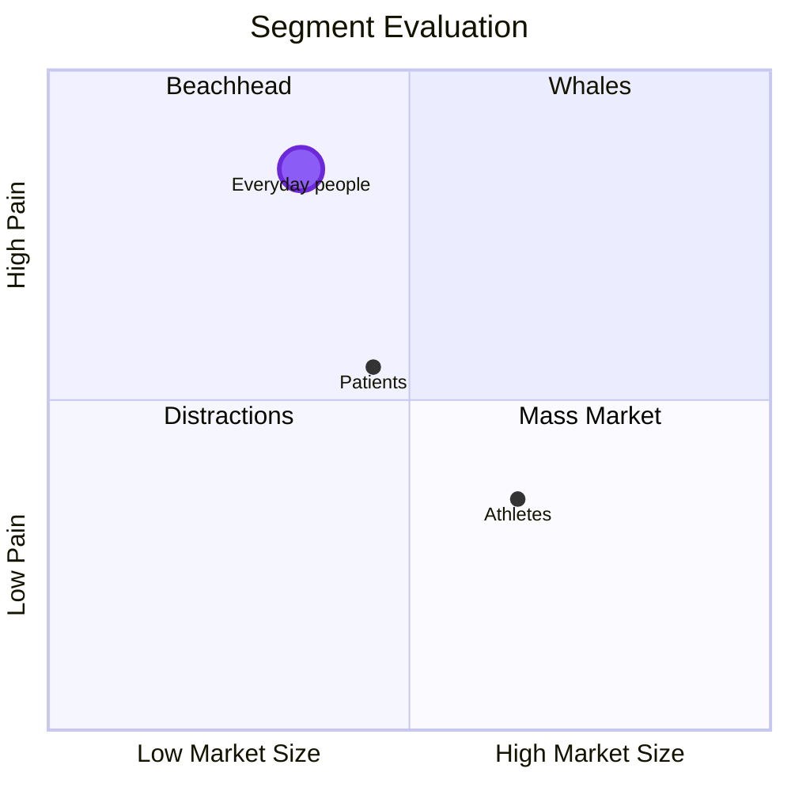

### Segmentation

You can't serve everyone first. The quadrant below plots three possible Pulse segments against two dimensions: market size and how acute the pain point is. Read the book for tips on quadrant selection and not that your initial market doesn't have to be your forever market.

---

