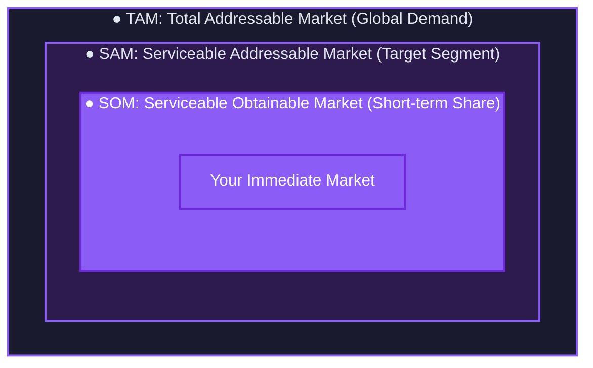

### TAM/SAM/SOM

Market sizing narrows from the broadest possible demand down to the share you can realistically win. Each layer sits inside the last: the whole market, the part you could serve, and the part you can actually capture soon.

The SOM is the number that should shape your near-term plans. A huge TAM looks exciting in a pitch, but the share you can realistically win this year is what you actually build and market against.