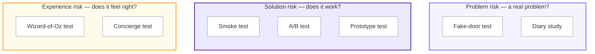

# Choosing a Validation Method: Risk Categories to Tests

Some tests fit more than one bucket. This diagram assigns each test to its most common use. It's a general reference, not a strict definition.

A few common experiment types, and what each is good for:

**A/B test**: show two variants to different users and compare a metric. Tests which of two known options performs better, not whether the idea itself is right. (Solution risk.)
Diary study ask a small group to log their behaviour or reactions over days or weeks. Tests how something holds up in real use over time, not just in a single sitting. (Problem or experience risk.)

**Concierge test**: deliver the service manually, by hand, before building anything automated. Tests demand and experience at once, at the cost of not scaling. (Experience risk.)

**Diary study**: study ask a small group to log their behaviour or reactions over days or weeks. Tests how something holds up in real use over time, not just in a single sitting. (Problem or experience risk.)

**Fake-door test**: advertise a feature that doesn't exist yet (a button, a landing page) and measure who clicks. Tests demand before you build anything. (Problem risk.)

**Prototype test**: put a mockup or working prototype in front of users and watch them use it. Tests usability and reaction before full engineering investment. (Solution or experience risk.)

**Smoke test**: a minimal, often manual version of a feature, released to see if anyone uses it. Tests whether the solution gets picked up at all. (Solution risk.)

**Wizard-of-Oz test**: a real-looking front end with a human faking the technology behind it. Tests whether the experience is valuable before you automate it. (Experience risk.)
