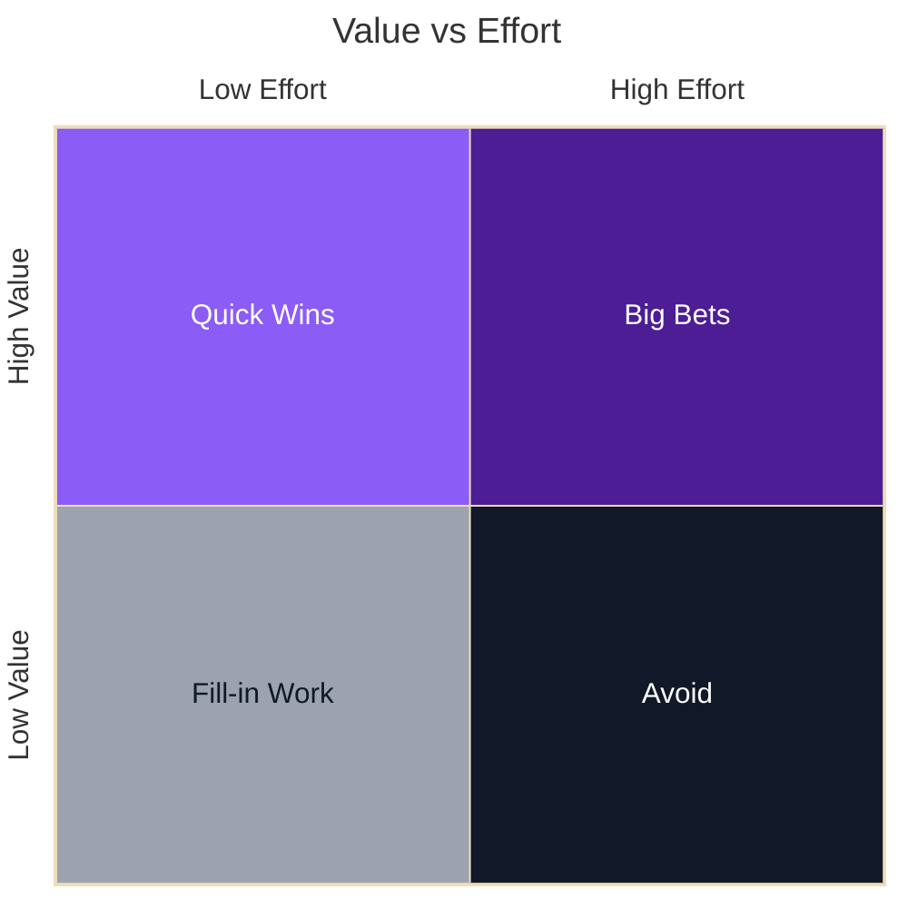

# Value vs Effort Matrix

```mermaid
---
config:
  theme: base
  themeVariables:
    quadrant1Fill: "#4C1D95"
    quadrant2Fill: "#8B5CF6"
    quadrant3Fill: "#9CA3AF"
    quadrant4Fill: "#111827"
    quadrant1TextFill: "#ffffff"
    quadrant2TextFill: "#ffffff"
    quadrant3TextFill: "#111827"
    quadrant4TextFill: "#ffffff"
---
quadrantChart
    title Value vs Effort
    x-axis Low Effort --> High Effort
    y-axis Low Value --> High Value
    quadrant-1 Big Bets
    quadrant-2 Quick Wins
    quadrant-3 Fill-in Work
    quadrant-4 Avoid
```