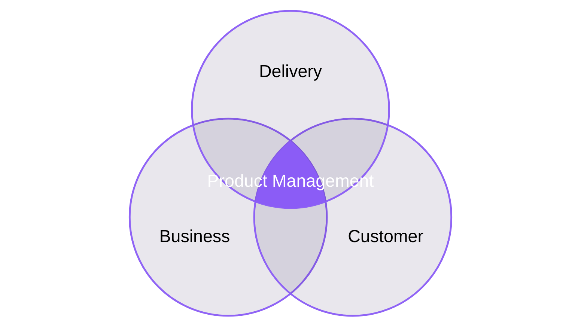

### Framework 1 — Venn Diagram of Product Management

```mermaid
venn-beta
  set A ["Business"]
  set B ["Customer"]
  set C ["Delivery"]

  union A,B [""]
  union B,C [""]
  union A,C [""]
  union A,B,C ["Product Management"]

  style A fill:#2D1B4E, stroke:#8B5CF6
  style B fill:#2D1B4E, stroke:#8B5CF6
  style C fill:#2D1B4E, stroke:#8B5CF6
  style A,B,C fill:#8B5CF6, stroke:#6D28D9, color:#FFFFFF
```

*Figure: Product management as an intersection of Business, Customer, and Delivery, adapted from Eriksson (2011).*