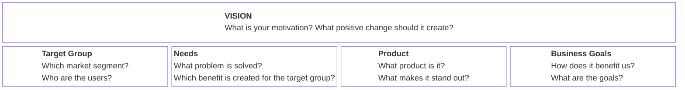
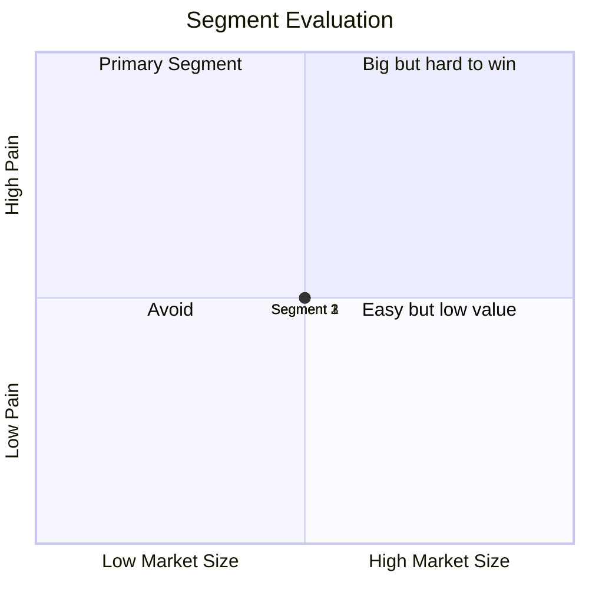
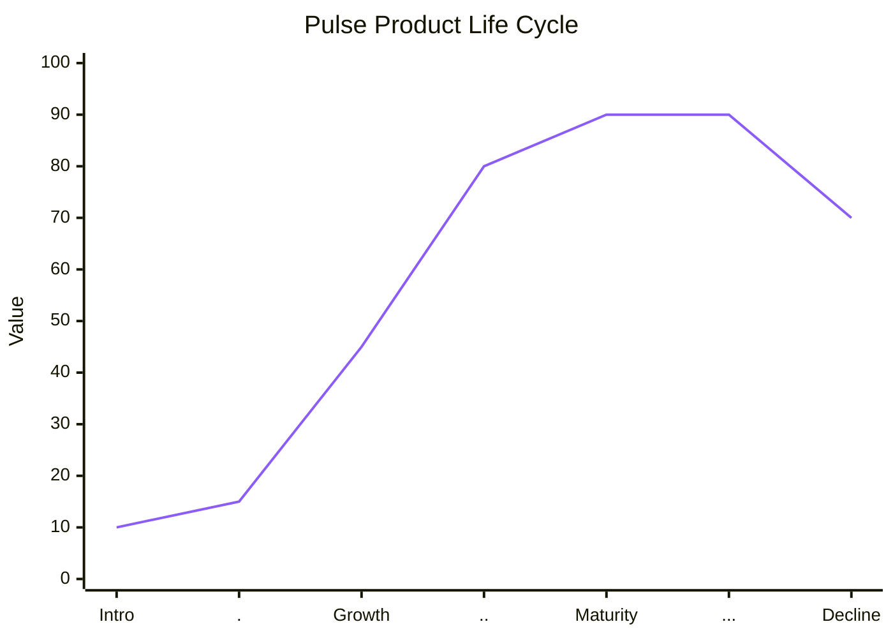

# Chapter 2 Lab — Strategy

## What you'll build

A one-page Pulse strategy brief: a completed Product Vision Board, a segmentation diagram with a justified primary segment, a positioning statement, and a lifecycle diagram.

---

## Part 1 — Product Vision Board

Fill in all five areas for Pulse. Use the Pulse mission and vision from Chapter 1 as your starting point, but make the board your own, your target group, your read on the needs, your product box.

> If a feature you want to include in the product box doesn't connect to a stated need, cut it or add the need.

---

## Part 2 — Segmentation diagram and primary segment

Identify at least three distinct segments Pulse could serve. Plot all three on the quadrant chart below by market size and pain intensity. Replace the example points with your own segments and coordinates.

**Your primary segment:**

**Why this segment first, and what makes them winnable?**

---

## Part 3 — Positioning statement

Write a positioning statement for Pulse using this format:

> For [target segment] who [have this problem], Pulse is a [category] that [key benefit]. Unlike [alternative], we [key differentiator].

The alternative should be a real category or product, not "other apps."

**Your positioning statement:**

> For \_\_\_ who \_\_\_, Pulse is a \_\_\_ that \_\_\_. Unlike \_\_\_, we \_\_\_.

---

## Part 4 — Lifecycle diagram

Plot where Pulse sits on the product lifecycle right now. Adjust the line to reflect your own assessment of Pulse's stage.

**What should Pulse be doing at this stage, and what should it be avoiding?**

---

## Part 5 — Use AI, then check it

Pick one part of your brief, the vision, the segments, or the positioning, and run it through an AI tool. Ask it to challenge your thinking: poke holes in the segment choice, suggest alternative positioning angles, or push back on the vision.

Read the response critically.

**One thing the AI suggested that you kept, and why:**

**One thing you rejected, and why:**

> If the AI made any factual claims, such as market size or competitor details, verify them before including anything in your brief. If you can't verify it, leave it out.

---

## Acceptance criteria
Add x to each when complete.

- [ ] All five Vision Board areas are filled and internally consistent
- [ ] The segmentation diagram plots at least three segments and clearly marks the primary segment
- [ ] The positioning statement names a specific alternative and a specific differentiator
- [ ] The lifecycle diagram marks Pulse's current stage and connects to a stated strategic implication
- [ ] The AI section names one suggestion kept and one rejected, with reasoning for each

---

## Submitting your work

Complete this file, commit, and push to your fork. A completed example is in `artifacts/examples/chapter2-lab-complete-example.md` if you want a reference.