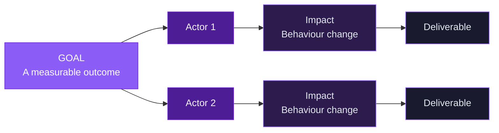

# Chapter 3 Lab — Discovery

## What you'll build

A _Pulse_ discovery brief including an impact map, a human interview you conduct, a competitive scan, a testable hypothesis with its riskiest assumption named, and an experiment.

---

## Part 1 — Impact map

Pick one improvement Pulse could pursue. Build an impact map starting from a measurable goal. Edit the diagram below to reflect your own goal, actors, impacts, and deliverables.

- **Goal:** _[a measurable outcome, not a feature]_
- **Actors:** _[who can help or hinder the goal?]_
- **Impacts:** _[what behaviour change do you want from them?]_
- **Deliverables:** _[what could you build to create that change?]_

---

## Part 2 — Conduct a real interview

This part happens away from your screen. Find one real person who fits the user you're designing for, someone who has actually tried to build a habit or used a health or tracking app, and interview them for ten to fifteen minutes.

Before the interview, write five open, non-leading questions. During it, follow the surprises rather than sticking rigidly to your script. Partway through, ask them to open Pulse in their browser and think out loud as they click around, so you can hear what they notice.

**Your five planned questions:**

1.
2.
3.
4.
5.

**Three things the person actually said** _(in their own words, as close to verbatim as you can capture):_

1.
2.
3.

**One thing that surprised you or contradicted your expectation:**

---

## Part 3 — Competitive scan

Find two existing products that address a similar problem.

**Product 1:** _[name]_
- One thing it does well:
- One recurring complaint from its reviews:

**Product 2:** _[name]_
- One thing it does well:
- One recurring complaint from its reviews:

**What these existing products reveal about the problem Pulse is trying to solve** _(one sentence):_

---

## Part 4 — Hypothesis

Using what you learned from the interview and the competitive scan, write a hypothesis.

> We believe [outcome] will happen if [actor] gets [benefit] from [solution].

**Your hypothesis:**

> We believe \_\_\_ will happen if \_\_\_ gets \_\_\_ from \_\_\_.

**The riskiest assumption inside it** _(the one thing that, if wrong, sinks the idea):_

---

## Part 5 — Experiment

Identify the cheapest experiment that could disprove your riskiest assumption.

- **Validation method** _(interview, prototype, Wizard-of-Oz, concierge, etc.):_
- **Why it fits the risk you're testing:**
- **A result that would tell you the assumption holds:**
- **A result that would tell you to stop:**

---

## Part 6 — Use AI, then check it

Use an AI tool to either generate additional interview questions or to challenge your hypothesis by naming a riskier assumption than the one you chose.

- **One thing you kept, and why:**
- **One thing you rejected, and why:**

> If the AI made any factual claims, verify them before relying on anything.

---

## Acceptance criteria

- [ ] The impact map starts from a measurable goal, not a feature
- [ ] A real interview was conducted, with five planned questions and 1-3 captured quotes
- [ ] The competitive scan covers two real products with a specific insight about the problem
- [ ] At least one hypothesis is written in the "we believe… if…" form, informed by the interview
- [ ] The riskiest assumption is named, with a matching experiment to test it
- [ ] The AI section names one suggestion kept and one rejected, with reasoning

---

## Submitting your work

Complete this file, commit, and push to your fork. A completed example is in `artifacts/examples/chapter3-lab-complete-example.md` if you want a reference.
