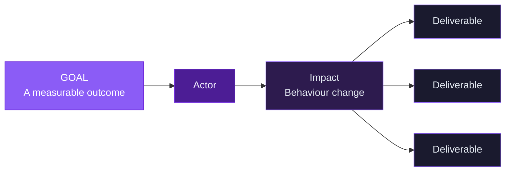
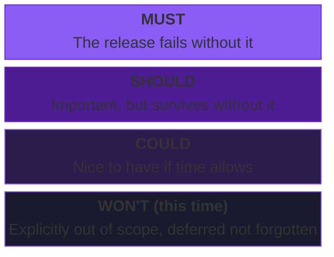

# Chapter 4 Lab — Prioritization

## What you'll build

A prioritized Pulse backlog: an impact map that generates your candidate work, RICE indicators for each item, and a MoSCoW-scoped release, with your reasoning made explicit.

---

## Part 1 — Start with an impact map

Prioritization works best on a backlog that came from somewhere. Start by building a short impact map for one Pulse goal, the same way you did in Chapter 3. The deliverables at the bottom become the candidates you'll prioritize.

- **Goal:** _[a measurable outcome]_
- **Actor:** _[who can help or hinder the goal?]_
- **Impact:** _[what behaviour change do you want?]_
- **Deliverables:** _[at least five candidate items to prioritize]_

List the deliverables here as your backlog:

1.
2.
3.
4.
5.

---

## Part 2 — RICE indicators

Score each deliverable on Reach, Impact, Confidence, and Effort. For every input, write a one-sentence justification. Calculate the RICE indicator (Reach × Impact × Confidence ÷ Effort) for each.

Remember RICE gives you a comparative indicator to inform judgment, not a final verdict. A higher number is a signal to look closer, not an automatic winner.

| Item | Reach | Impact | Confidence | Effort | RICE |
|------|-------|--------|------------|--------|------|
|      |       |        |            |        |      |
|      |       |        |            |        |      |
|      |       |        |            |        |      |
|      |       |        |            |        |      |
|      |       |        |            |        |      |

**Justifications** _(one sentence per input that needs explaining):_

-

---

## Part 3 — Defend your top choice

Pick the item you'd build first. In two to three sentences, argue why, using the RICE indicators as evidence but bringing in judgment where the numbers don't tell the whole story. If your top choice isn't the highest RICE indicator, explain why you're overriding it.

---

## Part 4 — MoSCoW scope

Take your backlog and scope a single release. Tag each item. Keep the Must list short and put at least one item in Won't, with a sentence on why it's deferred rather than cut.

- **Must:**
- **Should:**
- **Could:**
- **Won't (this time):** _[item + one sentence on why it's deferred]_

---

## Part 5 — Use AI, then check it

Ask an AI tool to produce RICE indicators for one of your backlog items from scratch. Compare its inputs to yours.

- **One place its estimate differed from yours:**
- **Which one you trust more, and why:**

> If the AI produced a confident number for an input it couldn't possibly know (like your reach), name it. That's false precision: a number that looks solid but rests on a guess.

---

## Acceptance criteria

- [ ] An impact map generates the backlog, starting from a measurable goal
- [ ] Every RICE input has a one-sentence justification
- [ ] The backlog is tagged Must, Should, Could, or Won't
- [ ] The Must list is short and at least one item is in Won't with a reason
- [ ] Your top choice is defended with RICE indicators and judgment
- [ ] The AI section names one differing estimate and which you trust more, with reasoning

---

## Submitting your work

Complete this file, commit, and push to your fork. A completed example is in `artifacts/examples/chapter4-lab-complete-example.md` if you want a reference.