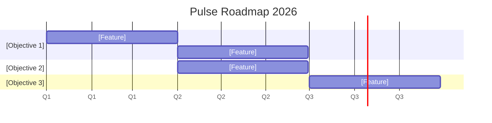

# Chapter 6 Lab — Execution

## What you'll build

A roadmap for Pulse and a DACI for one real cross-functional decision.

---

## Part 1 — Pick a method

In a short paragraph, choose a delivery method for the _Pulse_ team, Scrum, Kanban, or a blend, and justify it. What about the work makes your choice fit? What would have to change for you to pick differently?

**Your choice and reasoning:**

---

## Part 2 — Roadmap

Build a roadmap for Pulse that shows three things at once: **what** you'll ship, **approximately when** (use quarters, not firm dates), and **why**, each feature tied to the objective it serves.

Your objectives must tie back to the goals set earlier in the book or classroom work. Example: the business goals from the Chapter 2 vision board (week-two retention, organic referral in our example) and the retention goal from Chapter 3. This is a **must do** do not start inventing new objectives at roadmap time when you've already come up with them through prior work.

Use the Gantt template below. The `section` names are your objectives (the *why*); the bars under each are the features (the *what*); their position on the timeline is the approximate *when*. Add a caveat in your write-up that the timeline is a plan, and is subject to change.

> **How to edit this chart:** Each `section` is an objective (your *why*). Each line under it is a feature (your *what*) with a start date and a duration in days (`90d` is roughly a quarter). Move the start dates to place features in the quarter you expect them. The `axisFormat Q%q` setting labels the axis by quarter, so you show a general time without committing to an exact date.

**Your roadmap caveat (one or two sentences):** _[note that the plan is subject to change, and how you'd communicate a shift]_

---

## Part 3 — DACI for one decision

Pick one real cross-functional decision _Pulse_ faces (for example: which feature ships in the next release, which platform to build for first, or how to handle a user-data question). Assign the four DACI roles, and name any hard Principles that bound the decision.

- **Driver:** who runs the decision?
- **Approver:** the single person who makes the call.
- **Contributors:** who informs it?
- **Informed:** who's told the outcome?
- **Principles (hard constraints):** what limits (privacy, safety, legal) bound this decision rather than being up for debate?

---

## Part 4 — Use AI, then check it

Hand your roadmap or your DACI to an AI tool and ask it to challenge your thinking, poke holes in a timeline, question whether your single Approver is the right one, or flag a Contributor who should really be the Approver.

- **One thing you kept, and why:**
- **One thing you rejected, and why:**

---

## Acceptance criteria

- [ ] The method choice is justified by something specific about the work
- [ ] The roadmap shows the what, approximate when, and the why (each feature tied to an objective that traces back to an earlier goal/OKR)
- [ ] The DACI has exactly one Approver
- [ ] Hard constraints sit in Principles, not as a vote
- [ ] The AI section names one suggestion kept and one rejected, with reasoning

---

## Submitting your work

Complete this file, commit, and push to your fork. A completed example is in `artifacts/examples/chapter6-lab-complete-example.md` if you want a reference.