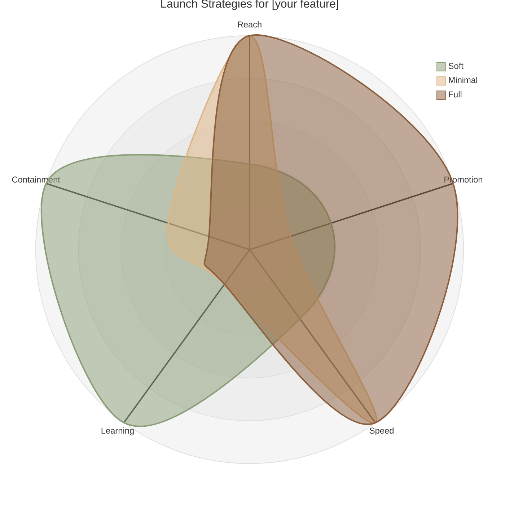

# Chapter 7 Lab — Go-to-Market

## What you'll build

A launch plan for a Pulse feature: a strategy you chose by comparing your options on a radar, named cross-functional owners, and pre-agreed thresholds.

---

## Part 1 — Plot the strategies and choose one

Pick a _Pulse_ feature (one your prioritized from prior work in this book). Before you choose how to launch it, plot the three strategies on a radar chart so you can see the trade-offs side by side. Use the template below. Adjust the scores if you'd reason about them differently for your feature.

> **How to edit this chart:** Each strategy is a `curve` line with five numbers in `{ }`, one per axis, in this order: Reach, Promotion, Speed, Learning, Containment. Each is scored 0 (low) to 5 (high). For example, `curve soft["Soft"]{2, 2, 2, 5, 5}` means soft launch is low on the first three and high on the last two. Change the numbers to match how you'd score each strategy for *your* feature. If your feature changes the picture, say a soft launch that still needs some promotion, adjust the relevant number.

**Your chosen strategy:** _[soft / minimal / full]_

**Justify it (2–3 sentences).** Point to the radar: given your feature's risk and novelty, which shape fits, and why? What are you trading away by picking it?

---

## Part 2 — If soft, define the four elements

If you chose a soft launch (and for anything with AI, you probably should), define all four. Both thresholds need real numbers or clear conditions, not "if it goes well."

- **Audience:** who gets it first?
- **Success metric:** what are you watching?
- **Expansion criteria:** what result tells you it's safe to widen?
- **Rollback trigger:** what result tells you to pull back?

---

## Part 3 — Cross-functional launch plan

Name the owners for your launch, and for each, write one line on what "ready" means for them before launch day. Name the grops you'd choose. Some options:

**Edit this list to reflect the groups you recommend be a part of your launch:**

| Area | Define ready |
|---|---|
| Communications | Messaging is drafted, reviewed and scheduled to go out with the launch |
| Support | Support knows what's shipping and has an FAQ ready for questions from users |
| Monitoring | Dashboards and alerts are live and pre-release data is flowing in |
| Go/no-go call | One specific person has visibility into all areas and authority to green light or delay |

---

## Part 4 — Keep the claims honest

Write one or two sentences of launch copy for your feature.

**Your launch copy:**

Then check every claim in it: is it true, and can you source it? Rewrite anything you can't stand behind. If any claim could cross a regulatory line for a health product, flag it.

**Your check:**

---

## Part 5 — Use AI, then check it

Use an AI tool to draft launch copy or a set of FAQs for your feature. Then audit it.

- **One claim the AI made that you'd need to verify or soften before publishing:**
- **Why:**

---

## Acceptance criteria

- [ ] The three strategies are plotted on a radar, and the chosen strategy is justified against the feature's risk and novelty using it
- [ ] If a soft launch, audience, success metric, expansion gate, and rollback trigger are all defined with real thresholds
- [ ] Cross-functional owners are named, with a readiness definition for each
- [ ] Every public claim in the launch copy is checked and sourced, with any regulatory risk flagged
- [ ] The AI section names one claim that needed verifying or softening, with reasoning

---

## Submitting your work

Complete this file, commit, and push to your fork. A completed example is in `artifacts/examples/chapter7-lab-complete-example.md` if you want a reference.