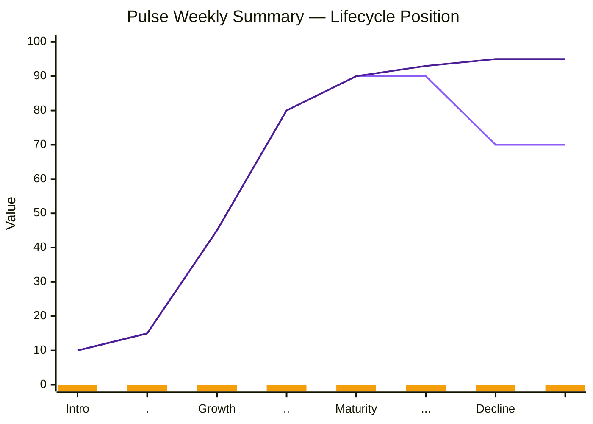
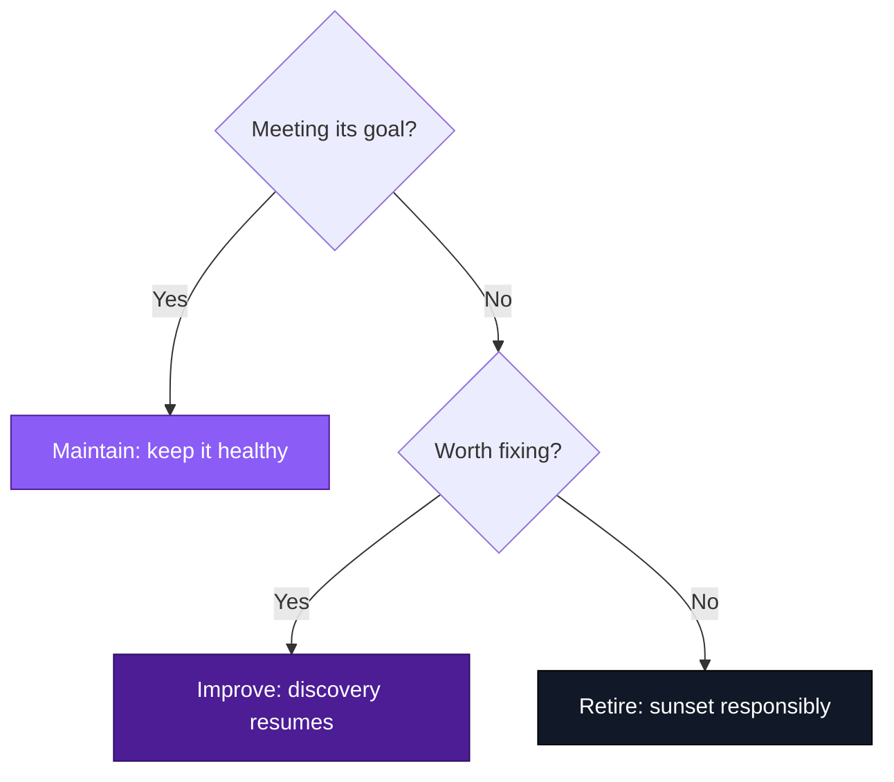

# Chapter 8 Lab — Post-Launch Management

**What you'll build:** a maintain, improve, or retire decision on a Pulse feature, made against dummy data and tied to a stated kill line.

Data: `/artifacts/data/pulse-post-launch-derived.csv`

---

## Part 1 — Read the data

Using the Pulse dataset (`/artifacts/data/pulse-post-launch-derived.csv`), plot the weekly numbers. You can use AI, a spreadsheet tool, or code, whatever's fastest for you, or fill in the chart template below directly. Either way, plot at least the leading indicator, the lagging indicator, and guardrail flags together, so you can see how they move relative to each other.

A quick reminder of the difference:

```mermaid
flowchart TD
    NS[North Star metric] --> L[Leading indicator]
    NS --> G[Lagging indicator]
    L --> L1[Return after summary - Pulse]
    L --> L2[Trial-to-signup clicks]
    G --> G1[Week-two retention - Pulse]
    G --> G2[Monthly revenue]

    classDef northstar fill:#111827,stroke:#000000,color:#fff
    classDef leading fill:#8B5CF6,stroke:#4C1D95,color:#fff
    classDef lagging fill:#4C1D95,stroke:#2e1065,color:#fff
    class NS northstar
    class L,L1,L2 leading
    class G,G1,G2 lagging
  ```
  

**Chart template** (fill in the eight `0`s in each row with your week 1–8 values from the CSV; leave any row blank at `0`s if you'd rather chart it another way):

```mermaid
---
config:
  themeVariables:
    xyChart:
      plotColorPalette: '#8B5CF6, #4C1D95, #F59E0B'
---
xychart-beta
    title "Pulse Weekly Summary — Post-Launch Data"
    x-axis ["1", "2", "3", "4", "5", "6", "7", "8"]
    y-axis "Value" 0 --> 100
    line [0, 0, 0, 0, 0, 0, 0, 0]
    line [0, 0, 0, 0, 0, 0, 0, 0]
    bar [0, 0, 0, 0, 0, 0, 0, 0]
```

*First `line` = leading indicator, second `line` = lagging indicator, `bar` = guardrail flags. Guardrail flags are small numbers on this 0–100 scale, watch the shape of the trend rather than the height.*

Then, in a few sentences, describe what's happening: is the feature growing, mature, or declining? Point to specific weeks. Name which metric is your leading indicator and which is lagging, and say what each is telling you. Note anything the chart makes obvious that the raw numbers alone might not.

*Your reading of the data here.*

---

## Part 2 — Locate the lifecycle stage

Based on the data, place the feature in its lifecycle stage (development, introduction, growth, maturity, or decline) and justify it with the numbers.

Mark your feature's position on the diagram below. The two curves show two common life cycle patterns, one that plateaus, one that declines faster. The third row (`bar`) is your marker: change exactly one `0` to a value that roughly matches the curve's height at that point, so a single marker appears sitting right on the curve where your feature sits.

**Index-to-stage key**, position in the array (left to right) maps to the x-axis label in the same order: `0=Intro`, `1=.`, `2=Growth`, `3=..`, `4=Maturity`, `5=...`, `6=Decline`, `7=(end)`.



*Your lifecycle placement and justification here.*

---

## Part 3 — Make the call

Decide: maintain, improve, or retire. Tie your decision explicitly to the feature's original success metric (from the earlier chapters). If you chose improve, say what discovery you'd resume. If you chose retire, say how you'd do it responsibly.



*Your verdict and reasoning here.*

---

## Part 4 — State the kill/pivot line and monitoring plan

Name the threshold that would change your verdict, the kill or pivot line, and state it in advance. Then name the few metrics you'd monitor going forward, including at least one behavioural signal if the feature uses AI.

**Kill/pivot line:** *[state the specific threshold]*

**Monitoring plan:** *[the few metrics you'd keep watching, and why each one]*

---

## Part 5 — Use AI, then check it

Hand the data to an AI tool and ask it for a maintain/improve/retire recommendation. Compare its call to yours. Note one thing it saw that you missed, and one thing it got wrong or overstated (for example, a confident claim the data doesn't actually support).

- **One thing it saw that you missed:**
- **One thing it got wrong or overstated:**

---

## Acceptance criteria

- [ ] The data is read with specific reference to columns and weeks, and a leading vs. lagging indicator is named
- [ ] The feature is placed in a lifecycle stage, justified by the data
- [ ] The verdict (maintain/improve/retire) is tied to the original success metric
- [ ] A kill/pivot line is stated in advance, and a monitoring plan is named
- [ ] The AI section names one thing the AI caught and one it got wrong, with reasoning

---

## Submitting your work

Complete this file, commit, and push to your fork. A completed example is in `artifacts/examples/chapter8-lab-complete-example.md` if you want a reference.